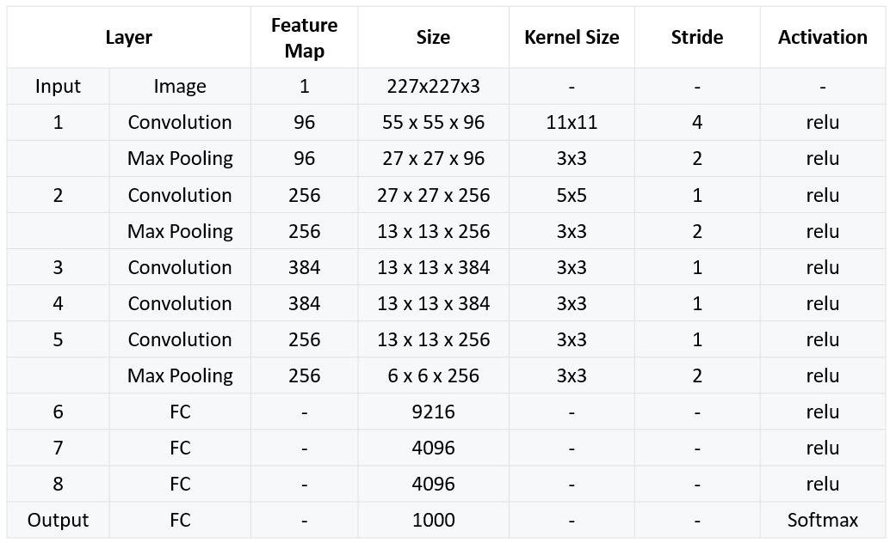
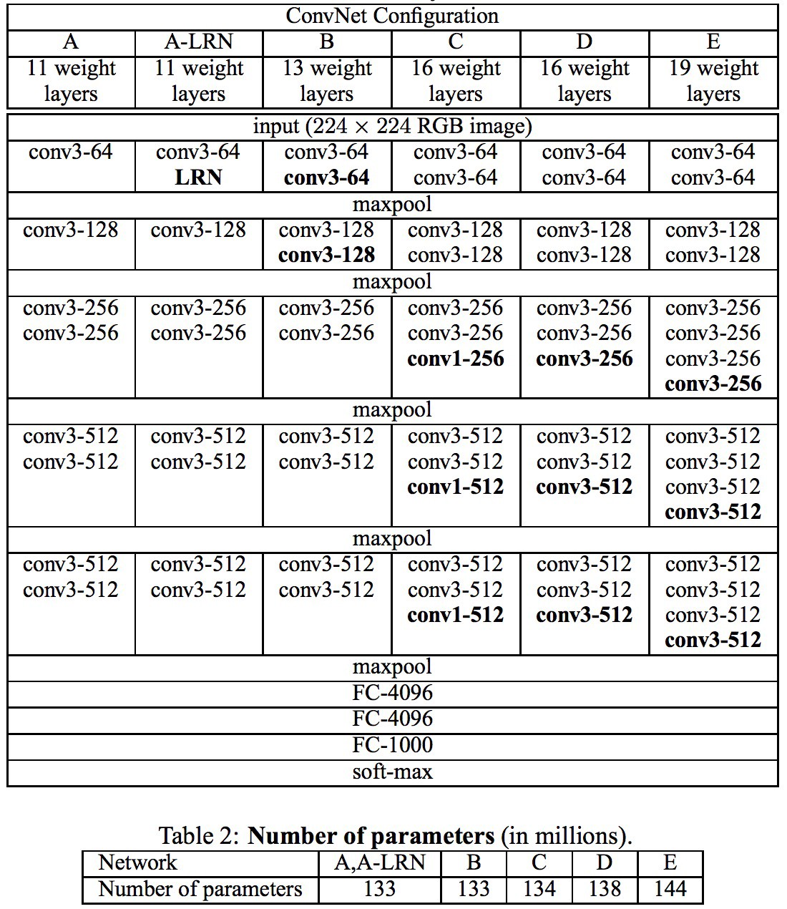
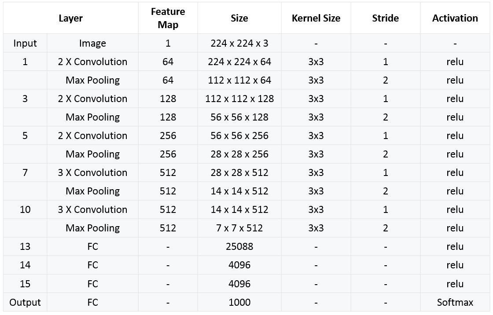

# CNN

Convolutional Neural Networks

## Foundation

### 卷积层（Convolutional layer)

**作用：**对输入的数据进行**特征提取**，可对应多个卷积核，一般来说经过卷积层后，尺寸变小，厚度变厚，越往后面感受野变大，既降尺寸，又降厚度，参数需要学习

卷积核和图像一样有通道数，卷积核滑动步长（stride），每个卷积核对应一个局部特征（梯度特征）

为了让输入图像的全部像素都能被滑动窗口捕获，使用same方式在输入图像最外层加上指定层数（padding）全为0的像素边界，使用valid方式不做像素填充。经过卷积后输出图像的宽度与高度参数如下：
$$
\begin{array}{l}{\text { Woutput }=\frac{W_{\text {input }}-W_{\text {filter }}+2 P}{S}+1} \\ {H_{\text {output }}=\frac{H_{\text {intput}}-H_{\text {filter }}+2 P}{S}+1}\end{array}
$$
多通道卷积操作：卷积核变为$ kernelsize*kernelsize*c $单独通道卷积后求和+偏置,如下图：

### 池化层(Pooling layer)

**作用：****一种提取输入数据核心特征的方式，特征融合、降维压缩原始数据**，减少参与模型计算的参数，不降通道数，只降图片尺寸，参数不需要学习

常用方法：平均池化、最大池化
$$
\begin{aligned} W_{\text {output}} &=\frac{W_{\text {input}}-W_{\text {filter}}}{S}+1 \\ H_{\text {output}} &=\frac{H_{\text {input}}-H_{\text {filter}}}{S}+1 \end{aligned}
$$

### 全连接层(Fully-Connected layer)

**作用：推理器、分类器**，将前两层的输出给到一个完全连接前馈网络，经激活函数处理，便可以得到分类预测的结果，全局感受野，直接去除空间信息，需要学习参数，等效于全局卷积（1x1卷积）

下图是一张28x28的图片经3x3的卷积核（最外层加一层0、步长为1）的卷积层，2x2的步长为2的最大池化层、再经过一个全连接层的结果。

### Softmax层(批量归一化层-Batch Normalization layer)

指数归一化函数
$$
\sigma(\mathbf{z})_{j}=\frac{e^{z_{j}}}{\sum_{k=1}^{K} e^{z_{k}}} \quad \text { for } j=1, \ldots, K
$$
将一个实数值向量压缩到（0，1）

## Traning tricks

### 图像像素中心化

（R,G,B)减去各自通道的均值

### 防过拟合，提高泛化能力

**数据增强**：

1.在256x256的图片中，随机裁剪一块224x224的子区域

2.旋转、反转

**Dropout随机失活**：一般是让一半的神经元仍有推断能力，反向传播时不经过这些节点，防止网络过度依赖全部节点，只在training时dropout

**Weight decay权重衰减（L2正则）**：其中$C_{0}$为原本的loss function
$$
C=C_{0}+\frac{\lambda}{2 n} \sum_{w} w^{2}
$$

## 感受野（ Receptive Field ）

在卷积神经网络中，感受野（Receptive Field）的定义是卷积神经网络每一层输出的特征图（feature map）上每个像素点在原始图像上映射的区域大小，这里的原始图像是指网络的输入图像，是经过预处理（如resize，warp，crop）后的图像。

神经元之所以无法对原始图像的所有信息进行感知，是因为在卷积神经网络中普遍使用卷积层和pooling层，在层与层之间均为局部连接。 

神经元感受野的值越大表示其能接触到的原始图像范围就越大，也意味着它可能蕴含更为全局，语义层次更高的特征；相反，值越小则表示其所包含的特征越趋向局部和细节。因此感受野的值可以用来大致判断每一层的抽象层次.

i.e,

计算公式：
$$
r_{n}=r_{n-1} * k_{n}-\left(k_{n}-1\right) *\left(r_{n-1}-\prod_{i=1}^{n-1} s_{i}\right) \quad n>=2
$$

## CNN的发展

常见的CNN 结构一般为：输入～＞［［ 卷积～＞激活函数］ × N ～＞池化］ × M ～〉［ 全连接～＞激活］ × K ～＞全连接， N 个卷积＋激活＋池化构成一个子网络，通过叠加这个子网络达到增强整个网络表达能力的效果，接着再跟上几组全连接加激活的子网络， 最后进行一次全连接＋ s。如nax （对于二分类使用sigmoid ）。这样就可以使网络模块化，搭建网络就像搭积木一样简洁。

### AlexNet

Hinton课题组，2012ILSVRC冠军，一举超越SVM，标志着DNN革命的开始

训练时长：2weeks，5个卷积层，3个全连接层，60M个参数，650k个神经元

新技术：ReLU、最大池化、dropout、局部响应归一化（Local Response Normalization,LRN)

详细参数如下表：

对于conv1的Pad是否为2仍然有争议

#### 局部响应归一化（Local Response Normalization)

$$
b_{x, y}^{i}=\frac{a_{x, y}^{i}}{\left(k+\alpha \sum_{j=i-n / 2}^{i+n / 2}\left(a_{x, y}^{j}\right)^{2}\right)^{\beta}}
$$

在某一层得到多通道的响应图后，对相应图上某一位置和临近通道的值按上式做归一化，$k,\alpha,\beta$均为超参数，$n$为局部通道的总数，模拟的是动物神经的横向抑制效应。

若该通道和邻近通道的绝对之都比较大，归一后值有更小的趋势。但VGG组发现LRN在11层网络中已经起了负作用。而且将LRN放在maxpool层前，在计算上并不经济，caffenet将两层的顺序更换，进行了改进。

### VGG

由牛津大学视觉几何组（visual geometry group),2014ILSVRC定位第一，分类第二，网络改造的首选基础网络

核心思想卷积核拆解，或者说将卷积核的size固定为3x3，5拆成两个3x3,7拆成3x3,不同层数的VGG参数如下：

### NiN（Network-in-Network)

提高CNN的局部感知区域（bottleneck）,为1x1卷积层，通过调整1×1卷积核的数量，可以在不改变输入feature map尺寸和感受野的情况下，灵活地增加或减少feature map的channel数量，**特征组合与降维、引入更多的非线性**，当然也可以升维，表达能力更强，在实现feature map间信息交流的同时，获得信息的压缩或增广表示。 相当于直接压缩特征图厚度，节省了计算资源。

### 全局平均池化（Global Average Pooling）

对最后一层卷积的响应图，每个通道求整个响应图的均值，再接一层全连接，全局池化后的值相当于一像素，最后的全连接相当于一个加权相加，这种结构比直接的全连接更直观，泛化性更好。

把特征图全局平均一下输出一个值，也就是把$H*W*D$的一个张量变成$1*1*D$的张量 

### GoogleNet

2014分类第一，减少参数，降低计算，增加宽度、深度

#### Naive Inception

1）所有卷积层直接和上层的输出对接，卷积核的参数异常多，计算量异常大，2）最大池化层不改变深度，合并时深度增加明显，计算量过大

#### Inception V1

1）**分离与合并**，增加多尺度适应性，增加网络宽度 ，串接合并所有分支输出，2）使用**1x1卷积**进行特征降维与组合，极大降低后续卷积操作的卷积参数数量，3）取消参数量大的FC，本质是全尺寸的卷积层，由**全局平均池化**代替，4）**两个辅助分类器**，解决前几层的梯度消失，测试阶段不使用

具体的参数如下：

网络结构如下：

#### Inception V2

1）**批量归一化（Batch Normalization)**，在batch范围内对每个特征通道分别进行归一化,解决Internal Covariate Shift问题（神经元数据分布发生变动）,保证训练数据里数值都在同一**量级**上，使训练时的数值更加稳定。 **批量归一化层**的提出是针对这个情况。它**将一个批量里的输入数据进行归一化然后输出**。如果我们将批量归一化层放置在网络的各个层之间，那么就可以不断的对中间输出进行调整，从而保证整个网络的中间输出的**数值稳定性**。 

- 白化：使每一层的输出规范到$N(0,1)$,因为大多数激活函数在$(-1,1)$间都有较大梯度，故可以允许较高学习率, $conv \to BN \to ReLU$

- 可取代部分Dropout，注意BN在卷积层，Dropout在全连接层

- $$
  \begin{array}{c}{\mu \leftarrow \frac{1}{m} \sum_{i=1}^{m} x_{i}} \\ {\sigma^{2}=\frac{1}{m} \sum_{i=1}^{m}\left(x_{i}-\mu\right)} \\ {\hat{x}_{i} \leftarrow \frac{x_{i}-\mu}{\sqrt{\sigma^{2}+\varepsilon}}}\end{array}
  $$

  

-  这里ϵ是一个很小的常数保证不除以0 ，但这样并不是最好的分布，i.e,数据本身不对称，激活函数在$(-1,1)$间梯度变化不大，因此配对使用scale和shift，$\gamma,\beta$需要学习

- $$
  \hat{y}_{i} \leftarrow \gamma \hat{x}_{i}+\beta
  $$

- Training：每个batch中$\mu,\sigma$会被存储，Testing:使用所有batch的$\mu,\sigma$均值

2）卷积核：卷积核拆解

#### Inception V3

工程实验因素明显

1）**非对称卷积**：NXN分解成$1*N\to N*1$,降低参数数量和计算量

2）不同分辨率使用不同inception modules

- 

- 

3）解决pooling导致的特征损失与计算量增大之间的矛盾

​		提出了如下解决方案：卷积分支与池化分支并行，然后串接分支结果

4）取消完全无用的浅层分类器，深层辅助分类器只在训练后期有用，起到一定正则化作用

#### Inception V4

引入残差的思想：

### ResNet残差网络

2015分类任务第一，发明者为何凯明，现在Facebook AI

**目的：**解决退化问题

**退化问题**：随着层数加深到一定程度，越深的网络效果反而更差，并不是因为"深"造成了过拟合或梯度传播的衰减

​					**简单的例子**：堆叠一层使堆叠后的输出和堆叠前的输出相同，即使用全为1x1的值为1的卷积核，但实验结果表明，网络层数达到一定深度，结果变差

深度更深，$\frac {\partial L}{\partial W} >1$，一般来说浅层的卷积核尺寸大，因为浅层需要大的感受野来感知原始信息

1）残差网络（Residual net)

-  因为Plain net（朴素网络）可以拟合任意目标映射，故Residual可以拟合任意目标映射，
- $F(x)$对于$x$来说是残差映射
- 当$H(X)$接近$x$时，很容易捕捉到小的波动

2) 除了第一层的7X7卷积层，剩下全是3x3卷积层

3）卷积步长为2代替池化，使用BN，取消全连接层，取消Dropout

4）恒等映射两种使用情况：残差模块的输入数据若和输出结果的维度一致，贝lj 直接相加；若维度不一致，则先进行线性投影，在得到一致的维度后，再进行相加或者对维度不一致的部分使用0 填充。

注意此处的相加为通道直接叠加，详细参数：

### ResNeXt网络

2016竞赛第二

1)提出第三个DNN维度，**cardinality基数**，采用Split-Transform-Aggregate策略将卷积核按通道分组，形成32个并行分支，最后逐像素进行加法合并

2）100层ResNeXt相当于200层ResNet，

没有基数前的参数数量：$256*1*1*64+64*3*3*64+64*1*1*256 = 69632$

并行分支后的参数数量：$32*(256*1*1*4+4*3*3*4+4*1*1*256) = 70144$可见参数数量差别不大

3）增加基数会不断提高性能

详细参数：

**FLOPs**： floating point operations ， 意指浮点运算数，理解为计算量。可以用来衡量算法/模型的复杂度 

**FLOPS**: floating point operations per second , 意指每秒浮点运算次数，理解为计算速度。是一个衡量硬件性能的指标。 

### 对比

ImageNet分类的准确性和执行效率对比：

场景分类的性能对比：

### CNN的设计准则

1.**避免信息瓶颈**:使数据量$H*W*C$缓慢变小，不能突降或突升

2.**通道（卷积核）数量保持在可控范围内**，假设输入通道为$C$，输出通道为$K$,则参数数量为$H_{f}*W_{f}*C*K$,操作数量为$\frac {H*H_{f}}{stride}*\frac {W*W_{f}}{stride}*C*K$

3.**感受野要足够大**

- 多个小尺寸卷积核比用一个大的卷积核更优，参数少，计算快；多个非线性激活，i,e. $64*5*5*64<64*(3*3+3*3)*64$,且多了一个激活函数，非线性因素更多

4.**分组策略**，降低计算量，i,e.$64*3*3*64+32*3*3*32<96*3*3*96$

5.**低秩分解**：降低参数，降低计算量

