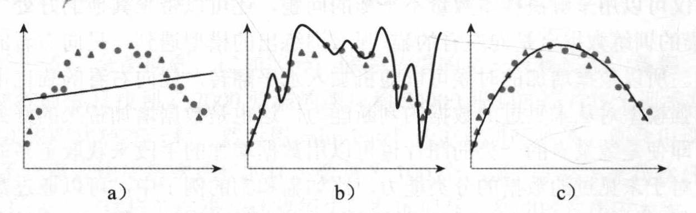
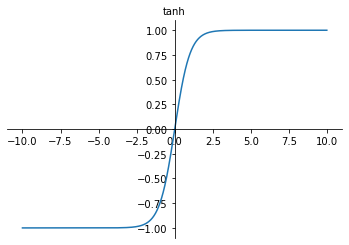
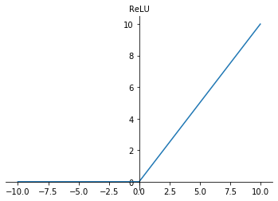

# Notes of Machine Learning 

Min Chen Yang,  Hunan University,  2019.11

## 初识机器学习

**从原始数据中提取模式的能力。**

进入21世纪，纵观机器学习发展历程，研究热点可以简单总结为2000-2006年的流形学习、2006年-2011年的稀疏学习、2012年至今的深度学习 、未来迁移学习？

人工智能的真正挑战在于解决对人来说很容易执行，但很难形式化描述的任务。

 常用的10大机器学习算法有：决策树、随机森林、逻辑回归、SVM、朴素贝叶斯、K最近邻算法、K均值算法、Adaboost算法、神经网络、马尔科夫 

大致分类：

监督式学习：决策树、KNN（K邻近）、朴素贝叶斯(贝叶斯分类器）、逻辑回归、支持向量机

非监督式学习：聚类、主成分分析PCA

深度学习：卷积神经网络、自编码器、循环神经网络

## Deep Learning

### 初识

**让计算机从经验中学习，根据层次化的概念体系来理解世界，每个概念通过与相对简单的概念之间的关系定义。**

### 数学基础

一维数组，二维矩阵，三维张量

#### 雅可比Jacobian矩阵 


#### 海森Hessian矩阵


#### softmax函数（归一化指数函数）

$$
\sigma(\mathbf{z})_{j}=\frac{e^{z_{j}}}{\sum_{k=1}^{K} e^{z_{k}}} \quad \text { for } j=1, \ldots, K
$$

观察到的数据属于某个类的概率,经常将其作为神经网络的输出层

#### linear algebra

标量、向量、矩阵、张量

矩阵乘积、矩阵点积

单位矩阵、逆矩阵

生成子空间（列空间、值域）、线性相关（无关）、矩阵的奇异性

范数、欧几里得范数、最大范数

对角矩阵、正交矩阵、实对称矩阵

特征值、特征向量、矩阵的特征分解、实对称矩阵特征分解来优化二次方程

### DNN基础

感知机是神经网络的最小单元

#### 线性变化与仿射变换

**线性变换**：

- 变换前是直线的，变换后依然是直线
- 直线比例保持不变
- 变换前是原点的，变换后依然是原点

**仿射变换**：线性变换+平移

- 变换前是直线的，变换后依然是直线

- 直线比例保持不变

- 变换前是原点的，变换后依然是原点
  $$
  \vec{y}=A \vec{x}+\vec{b}
  $$

**通过线性变换来完成仿射变换**

通过高维度的线性变换完成低维度的仿射变换：
$$
\left[\begin{array}{l}{\vec{y}} \\ {1}\end{array}\right]=\left[\begin{array}{ll}{A} & {\vec{b}} \\ {0} & {1}\end{array}\right]\left[\begin{array}{l}{\vec{x}} \\ {1}\end{array}\right]
$$
假设某二维图形上每个点为$\vec{x}$，则$\left[\begin{array}{l}{\vec{x}} \\ {1}\end{array}\right]$表示将其平移到$z = 1$的平面上


线性不可分的样本在经过仿射变换后，仍然是不可分的

#### 监督学习

提供一组输入数据和其对应的标签数据，然后搭建一个模型，让模型在通过训练后准确地找到输入数据和标签数据之间的最优映射关系，在输入新的数据后，模型能够通过之前学到的最优映射关系， 快速地预测出这组新数据的标签。

##### 回归问题

模型通过训练后得到一个连续的线性映射关系，i.e,根据离散的（房屋面积，房屋价格）之间的关系找到房屋价格与房屋面积间的连续函数关系

##### 分类问题

模型通过训练后得到一个离散的线性映射关系，输出结果为有限个

#### 无监督学习

提供一组没有任何标签的输入数据，将其在我们搭建好的模型中进行训练，对整个训练过程不做任何干涉，最后得到一个能够发现数据之间隐藏特征的映射模型，使用这个映射模型能够实现对新数据的分类，使用无监督学习实现分类的算法叫做**聚类**。更具有创造性，有利于提高机器学习算法对新鲜样本的适应能力（泛化能力）。

半监督学习、弱监督学习等创新方法也在出现。

#### 欠拟合、过拟合



如图：a)为欠拟合，b)为过拟合，c）为正常训练出的模型

欠拟合：对已有数据的匹配性很差，但对数据中的噪声不敏感，不能对新数据准确预测

原因及解决方法：1）没有把握数据的主要特征，加入更多和原数据有重要相关性的特征来训练，2）增加函数次项来增加泛化能力，3）减少正则化参数:正则化参数是为了防止过拟合，若出现欠拟合，可减少正则化参数

过拟合：对数据的匹配性太好，对数据中的噪声特别敏感

解决方法：1）过度捕获了数据的有限特征，可增大训练的数据量，2）正则化：对目标函数增加一个参数范数惩罚，限制其学习能力

#### 后向传播

#### 损失和优化

损失函数:进行损失值计算的函数，均方误差（MSE)、均方根误差(RMSE)、平均绝对误差(MAE)

优化函数：对模型参数进行优化的函数，解决参数初始化、参数微调形式、学习速率如何选取的方案的集合

​					梯度：多元函数的偏导以向量的形式展示。

​					常用优化函数：

​					**1）全局梯度下降GD**：模型的训练依赖整个训练集，增加了计算损失值的时间成本和模型训练过程的复杂度

​					**2）批量梯度下降BGD**：将训练集分成若干份，每个批次（batch）使用一次来进行梯度更新，可能会导致局部最优

​					**3）随机梯度下降SGD**：随机从数据集中选取一部分参与模型训练，可能导致局部最优，受噪声影响严重

​					**4）Adam**：损失值大时采用大的$\eta$,反之采用小的$\eta$，对梯度消失、收敛过慢、高方差的参数更新等导致的损失值波动均有很好的方法。$\eta$过大会导致局部最优和抖动，反之会使参数优化的时间变长

​					**5）扰动—动量算法**

#### 激活函数

多层感知机无论多深，始终为线性，线性模型很难处理非线性问题，激活函数可带来非线性元素，抑制输出，便可近似拟合所有函数

##### Logistic sigmoid 函数

$$
f(x)=\frac{1}{1+e^{-x}}
$$


与生物神经网络的工作机理非常相似，

**1）**因$\frac{d f}{d x}\in(0\sim0.25)$,会导致梯度消失（后向传播时每逆向经过一个节点，梯度值缩小为$1/4$,t梯度值越来越小）

**2）**因$f(x)>0$,模型优化时收敛速度变慢，会增加时间成本，因此应尽量使用零中心数据，保证计算得到的输出结果是零中心数据

##### tanh函数

$$
f(x)=\frac{e^{x}-e^{-x}}{e^{x}+e^{-x}}
$$



tanh输出结果是零中心数据，可解决收敛速度变慢的问题，但$\frac{d f}{d x}\in(0\sim1)$,仍可能出现梯度消失，特别是$x\to-\infty$或$x\to+\infty$时，$\frac{d f}{d x}\to 0$

##### ReLU函数（修正线性单元）

$$
f(x) = max(0,x)
$$



分段线性、收敛速度非常快、无饱和问题、明显减轻梯度消失问题，但输出不是零中心数据，可能导致某些神经元永远不被激活，对应参数永远不被更新

解决方法：使用Xavier方法初始化参数

改进版本：Leaky—ReLU、R-ReLU

### 李宏毅note

DNN:深度神经网络

CNN：卷积神经网络

RNN：递归（循环）神经网络

LSTM：长短期记忆

##### 单层感知机模型实现与门、或门、非门

假定三个输入：$x_{0}=1,x_{1},x_{2}$,激活函数为用小于0时输出10，大于等于0时输出1

与门：输入均为1输出为1，其他输出为0，设定$w_{0}=-8,w_{1}=5,w_{2}=5$可实现

或门：有1为1，设定$w_{0}=-5,w_{1}=8,w_{2}=8$可实现

非门：去掉输入$x_{2}$,设定$w_{0}=10,w_{1}=20$可实现

异或门：单层只能处理线性可分问题，不能处理非线性问题，因此多层感知机诞生了。

##### 完全连接前馈网络

定义一组函数：


- 给定参数 𝜃, 定义一个函数；给定网络结构，定义一个函数集

- 

- $$
  f\left(\left[\begin{array}{c}{1} \\ {-1}\end{array}\right]\right)=\left[\begin{array}{l}{0.62} \\ {0.83}\end{array}\right]
  $$

深度学习的三个步骤：


模型和数据的拟合：

- 准备训练数据—图片及其标签
- softmax层作为输出层，正确结果应对应输出层的最大值

最优函数的选择：

- 神经网络的两个参数：权重和偏差
- 损失是神经网络输出和目标之间的距离

- 最优的函数：找到使总损失最小的参数 𝜽

- 关键计算算是关于参数的偏导

<u>选择的方法：梯度下降</u>       Backpropagation？

- 选取W的初始值,计算$$w \leftarrow w-\eta \partial L/ \partial w$$,直到$$\partial L/ \partial w$$足够小
- 不能保证全局最小值，不同的初始点到达不同的初始值
- 反向传播是一种有效的计算$\partial L/ \partial w$的方法—深度学习框架
- 
- $$\eta$$可认为其参数值更新的快慢，即学习率

##### 为什么使用深度神经网络

对于同样个数的神经元数量，浅胖或者深瘦？

**EX**：深瘦：长短发，男孩女孩，浅胖：长发男孩、长发女孩、短法男孩、短法女孩

深瘦: 每个基础分类器都可以有足够的训练实例   浅胖：长发男孩样本少，没有足够的训练实例


##### 神经网络变体

###### 卷积神经网络（CNN)

**为什么CNN用于图像识别**

1. 当处理图像时，全连接网络的第一层将会非常大  
2. 一些模式比整张图片小得多（如：识别鸟嘴即可识别出鸟），神经元通过较少的参数连接到小区域去发现模式
3. 同样的模式可能出现在图像的不同区域，不同区域的神经元可能相同
4. 对图像进行二次采样不会改变图像中的物体、使图像变小（获取图像压缩比例、加载图像缩略图、避免图片加载时的OOM异常 ）
5. 

**滤波器**

给定宽度和高度的滤波器，不同滤波器提取一个 patch 的不同特性。例如，一个滤波器寻找特定颜色，另一个寻找特定物体的特定形状。卷积层滤波器的数量被称为滤波器深度。

**图像的最大池化（Max Pooling）**

最大池化是基于样本的离散化过程。目的是对输入表示（图像，隐藏层输出矩阵等）进行下采样，以减小其尺寸，并允许对合并的子区域中包含的特征进行假设.

 通过提供表示形式的抽象形式来帮助过度拟合。同样，它通过减少学习参数的数量来减少计算成本，并为内部表示提供基本的平移不变性 。下图为步长为2的最大池化：


**CNN整体结构**


###### 循环神经网络（RNN)

**插槽填充**

输入序列向量化，将每一个输入的单词用向量表示，可以使用 One-of-N Encoding 或者是 Word hashing 等编码方法，输出预测槽位的概率分布

**1.1-of-N encoding**

向量是词典大小；每个维度对应于词典中的一个单词；这个词的维数是1，其他的是0；为了表示一些不知道的词汇，加入other这个维度

```
词典 = {apple, bag, cat, dog, elephant}
```

**2.Word hashing**（字串比对）


不同的序列如：arrive Taipei和leave Taipei，此时Taipei应该被放入不同的slot

因此引入具有记忆属性的RNN

**3.RNN（Elman Network）**


变式：深层、双向（可以考虑整个sequence的input）、Jordan Network


输出是有目标的，因此Jordan Network表现更好

**4.LSTM（长短期记忆）**

一种特殊神经元机构：4 inputs，1 output，memory cell


图中$$c^{\prime}=g(z) f\left(z_{\mathrm{i}}\right)+c f\left(z_{f}\right)$$,为memory cell的记忆更新值，激活函数使用sigmoid function，输出表示门的打开和关闭。输入向量点乘相应的权重向量得到输入、输出、以及遗忘“门”的输入通过激活函数的输出来决定“门”的开闭。

**5.Multiple-layer  LSTM**


一般的LSTM还靖上一层LSTM的memory cell的值、output与当前时刻的input合并为一个新的向量，再点乘相应权重向量，来控制该层LSTM。

Keras 支持LSTM、GRU（Gated Recurrent Unit、two gates、参数量少1/3、旧的不去新的不来）、SimpleRNN（memory不断被洗掉）

**6.RNN 训练技巧**


原因：memory cell不断与权重乘积

导致的问题：

1. 当$\partial L/ \partial w$非常大时，梯度下降的参数更新会将参数抛出很远，导致lost异常增大，因此应选择衰减速度足够慢的学习率，避免上坡运动。
2. 会出现梯度消失

**解决方法：**

**截断梯度**：在参数更新前，逐元素地截断**小批量产生的参数梯度**或**截断梯度$$g$$的范数**
$$
\begin{array}{c}{\text { if }\|g\|>v} \\ {g \leftarrow \frac{g v}{\|g\|}}\end{array}
$$
**LSTM**:可以解决梯度消失 (不能解决梯度爆炸)

1. 当forget gate打开时梯度永远不会消失

GRU可将input gate与forget gate联动，只有一个gate可打开，只有将memory cell清掉，才能输入；或者没有输入时，memory cell才能更新

**clockwise RNN、Structurally Constrained Recurrent Network (SCRN)**

**7.应用**

1. many to one :setiment  analysis(情感分析)

2. many to many（output is shorter）:语音识别，通过Connectionist Temporal Classification (CTC)来剔除重复的声音vector对应的输出（添加null来隔开相同的输出）

3. many to many（No limition、sequence to sequence):机器翻译，EX：根据中文声音信号转成英文文字

4. beyond sequence: syntactic parsing(语法分析)

5. auto-encoder:**Text**:考虑文件或语句的顺序将其变为向量 **Speech**：将声音信号编码为向量

   

   此时编码器和解码器同时工作，目标是使经过编码和解码后的输出与输入尽量相似。

###### 注意力集中模型

Attention-based Model、Neural Turing machine


**应用**

Reading Comprehension、Visual Question Answering

EX：Speech Question Answering


#### RNN vs  Structured Learning

### 深度学习框架

theano: 蒙特利尔大学蒙特利尔学习算法研究所开发 

caffe: CAFFE是一个深度学习框架，最初开发于加利福尼亚大学伯克利分校。Caffe在BSD许可下开源，使用C++编写，带有Python接口 

tensorflow: TensorFlow是一个开源软件库，用于各种感知和语言理解任务的机器学习 

keras: Keras是一个用Python编写的开源神经网络库，能够在TensorFlow、Microsoft Cognitive Toolkit、Theano或PlaidML之上运行 


API风格：上方为命令式，趋于统一；下方为符号式

### 深度学习与计算机视觉

图片分类（二分类、多分类），图像的目标识别，图像的语义分割、风格迁移