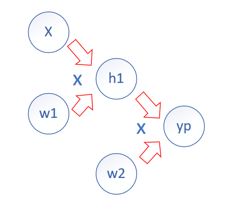

# PyTorch笔记

PyTorch 1.3.0

## 数据类型Tensor

### 浮点型、整型

```python
import torch
a = torch.FloatTensor(2,3) #按照指定维度随机生成浮点型tensor
b = torch.FloatTensor([2,3,4,5]) #按照给定列表生成浮点型tensor
a = torch.IntTensor(2,3) #整型同上
b = torch.IntTensor([2,3,4,5])
```

### 数据生成

```python
a = torch.rand(2,3) #生成0到1之间的随机浮点型tensor
a = torch.randn(2,3) #生成0到1之间的随机浮点型tensor，满足均值为0，方差为1
a = torch.arange(1,20,1) #生成一个等差数组，输入为起始值、结束值、步长
a = torch.zeros(2,3) #生成全0 tesnor
x = torch.zeros(5, 3, dtype=torch.long)
x = torch.empty(5, 3) #创建一个5x3的未初始化的Tensor
print(x.size()) #获取tensor的形状，torch.size为一个tuple
print(x.shape)
```

## tensor运算

```python
b = torch.abs(a) #取绝对值
c = torch.add(a,b) #两tensor相加
e = torch.add(c,10) #tensor与scalar相加
b = torch.clamp(a, -0.1, 0.1) #以-0.1为下边界，0.1为上边界将a截断
c = torch.div(a,b) #两tensor的元素相除。a/b
e = torch.div(d,10) #tensor与scalar相除
c = torch.mul(a,b) #两tensor的元素求积，同上
e = torch.mul(d,10)
b = torch.pow(a, 2) #tesnor元素指数运算
c = torch.mm(a, b) #两tenssor进行矩阵乘法运算
c = torch.mv(a, b) #a tensor与b向量乘积

```

## 第一个神经网络

【输入层100x1000】x【权重w1矩阵1000x100】= 【隐藏层输出100x100】

【隐藏层输出100x100】x 【权重w2矩阵100x10】= 【输出层输出100x10】

```python
import torch
batch_n = 100
hidden_layer = 100
input_data = 1000
output_data = 10

x = torch.randn(batch_n, input_data)
y = torch.randn(batch_n, output_data)
w1 = torch.randn(input_data, hidden_layer)
w2 = torch.randn(hidden_layer, output_data)

epoch_n = 30
learning_rate = 1e-6

for epoch in range(epoch_n):
    h1 = x.mm(w1) #100*1000
    h1 = h1.clamp(min = 0) #加上ReLU激活函数
    y_pred = h1.mm(w2) #100*10
    loss = (y_pred - y).pow(2).sum()
    print("Epoch:{}, Loss:{:.4f}".format(epoch,loss))
    grad_y_pred = 2*(y_pred - y)
    grad_w2 = h1.t().mm(grad_y_pred) #链式求导
    grad_h = grad_y_pred.clone()
    grad_h = grad_h.mm(w2.t())
    grad_h.clamp_(min=0)
    grad_w1 = x.t().mm(grad_h)
    w1 -= learning_rate*grad_w1
    w2 -= learning_rate*grad_w2
```

$$
\begin{array}x w_{1}=h_{1},h_{1}w_{2}=y_{p}
\\
\end{array}
$$

$$
\frac{\partial L}{\partial w_{2}}=\frac{\partial(y_{p}-y)^{2}}{\partial y_{p}}\frac{y_{p}}{w_{2}}=2(y_{2}-y)[h_{1}]^{T}
$$

通过前向传播和后向传播实现了对模型的训练和对权重参数的优化

## 自动梯度

### autograd与自定义传播函数

计算图：每一个节点表示一个变量，变量可以是任何类型，只是将计算形式化为图形的方法之一

操作：一个或多个变量的简单函数

解决${\partial L}/{\partial W}$的复杂链式求解问题，**最新版已不需要使用`torch.autograd`包中的`Variabale`类对输入的tensor数据进行封装**。用X 来代表我们选中的节点，那么`X.data `代表Tensor 数据类型的变量， `X.grad `也是一个Variable 对象，不过它表示的是X 的梯度，访问梯度值时需要使用`X.grad.data`

```python
import torch
#from torch.autograd import Variable
batch_n = 100
hidden_layer = 100
input_data = 1000
output_data = 10

class Model(torch.nn.Module): #继承torch.nn.Module类

    def __init__(self):
        super(Model, self).__init__()
    
    def forward(self, input, w1, w2): #实现前向传播的矩阵运算
        x = torch.mm(input, w1)
        x = torch.clamp(x, min = 0)
        x =torch.mm(x, w2)
        return x
    
    def backward(self): #实现后向传播的自动梯度计算
        pass
    
model = Model()

#x = Variable(torch.randn(batch_n, input_data), requires_grad = False)
#y = Variable(torch.randn(batch_n, output_data), requires_grad = False)
x = torch.randn((batch_n, input_data), requires_grad = False) #autograd不会保留梯度值
y = torch.randn((batch_n, output_data), requires_grad = False)

#w1 = Variable(torch.randn(input_data, hidden_layer), requires_grad = True)
#w2 = Variable(torch.randn(hidden_layer, output_data), requires_grad = True)
w1 = torch.randn((input_data, hidden_layer), requires_grad = True) #autograd保留梯度值
w2 = torch.randn((hidden_layer, output_data), requires_grad = True)

epoch_n = 20
learning_rate = 1e-6

for epoch in range(epoch_n):
    #y_pred = model(x,w1,w2) #完成神经网络的搭建
    y_pred = x.mm(w1).clamp(min = 0).mm(w2)
    loss = (y_pred - y).pow(2).sum()
    print("Epoch:{}, Loss:{:.4f}".format(epoch,loss.data))
    
    loss.backward() #根据设定求loss对各计算节点的梯度
    
    w1.data -= learning_rate*w1.grad.data
    w2.data -= learning_rate*w2.grad.data
    
    w1.grad.data.zero_() #将梯度清零，否则计算的梯度会累加
    w2.grad.data.zero_()
```




## 模型搭建和参数优化

### torch.nn

torch.nn 包提供了很多与实现神经网络中的具体功能相关的类,比如神经网络中的卷积层、池化层、全连接层这类层次构造的方法、防止过拟合的参数归一化方法、Dropout 方法，还有激活函数部分的线性激活函数、非线性激活函数相关的方法等

实现自动前向传播、后向传播、生成权重和偏置、损失函数的自动计算。

#### torch.nn中模型搭建的常用类

1.`torch.nn.Sequential`

一种序列容器，通过在容器中嵌套各种实现神经网络中具体功能相关的类，来完成对神经网络模型的搭建

模块加入的两种方式：1.按照代码顺序直接嵌套，默认使用从零开始的数字序列作为每个模块的名字。2.以`orderdict`有序字典的方式传入，模型的每个模块都有我们自定义的名字

2.`torch.nn.Linear`

输入：输入特征数、输出特征数、是否使用偏置，一般输入前两个会自动生成权重参数和偏置.

3.`torch.nn.ReLU`非线性激活函数类，`Sigmoid`,`Softmax`,`PReLU`,`LeakyRLU`,`Tanh`等

```python
hidden_layer = 100
input_data = 1000
output_data = 10
#按照代码顺序直接嵌套
models = torch.nn.Sequential(
torch.nn.Linear(input_data, hidden_layer),
torch.nn.ReLU(),
torch.nn.Linear(hidden_layer, output_data)
)
#以有序字典的方式传入
from collections import OrderedDict
models = torch.nn.Sequential(OrderedDict([
("Line1",torch.nn.Linear(input_data, hidden_layer)),
("Relu1",torch.nn.ReLU()),
("Line2",torch.nn.Linear(hidden_layer, output_data))])
)
print(models)
```

#### torch.nn中损失函数计算的常用类

1.`torch.nn.MSELoss`均方误差函数，Mean Square Error，预测值与真实值之差的平方的期望值

`torch.nn.L1Loss`平均绝对误差函数，预测值与真实值之差的绝对值的平均值

`torch.nn.CrossEntropyLoss`交叉熵
$$
C=-\frac{1}{n} \sum_{x} \sum_{j}\left[y_{j} \ln a_{j}^{L}+\left(1-y_{j}\right) \ln \left(1-a_{j}^{L}\right)\right]
$$
其中$a$是输出，$y$是真实的标签

#### 使用torch.nn搭建模型

通过对`models.parameters()`的遍历来实现每个参数的更新

```python
import torch
#from torch.autograd import Variable
batch_n = 100
hidden_layer = 100
input_data = 1000
output_data = 10
x = torch.randn((batch_n, input_data), requires_grad = False)
#x = Variable(torch.randn(batch_n, input_data), requires_grad = False)
y = Variable(torch.randn(batch_n, output_data), requires_grad = False)

models = torch.nn.Sequential(
torch.nn.Linear(input_data, hidden_layer),
torch.nn.ReLU(),
torch.nn.Linear(hidden_layer, output_data)
)

epoch_n = 10000
learning_rate = 1e-4
loss_fn = torch.nn.MSELoss()

for epoch in range(epoch_n):
    y_pred = models(x)
    loss = loss_fn(y_pred, y)
    if epoch%1000 == 0:
        print("Epoch:{}, Loss:{:.4f}".format(epoch,loss.data))
    models.zero_grad()
    loss.backward()
    for param in models.parameters():
        param.data -= param.grad.data*learning_rate
```

### 参数自动优化—torch.optim

固定的学习速率—参数优化更新没有自动化导致的问题，学习率是难以设置的超参数之一

解决方案：1.动量算法—引入另一超参数

​				   2.自适应学习率算法：SGD、AdaGrad、RMSProp、Adam等

​				   3.二阶近似算法

​				   4.元算法

`torch.optim.Adam`类的输入:被优化的参数、学习速率的初始值

```python
import torch

batch_n = 100
hidden_layer = 100
input_data = 1000
output_data = 10

x = torch.randn((batch_n, input_data), requires_grad = False)
y = torch.randn((batch_n, output_data), requires_grad=False)

models = torch.nn.Sequential(
torch.nn.Linear(input_data, hidden_layer), #w1
torch.nn.ReLU(), #激活函数
torch.nn.Linear(hidden_layer, output_data) #w2
)

epoch_n = 300
learning_rate = 1e-4
loss_fn = torch.nn.MSELoss() #损失函数计算
optimzer = torch.optim.Adam(models.parameters(), lr = learning_rate) #定义学习速率自动调节类

for epoch in range(epoch_n):
    y_pred = models(x)
    loss = loss_fn(y_pred, y)
    print("Epoch:{}, Loss:{:.4f}".format(epoch,loss.data))
    optimzer.zero_grad() #参数梯度归零
    loss.backward() #自动求解梯度
    optimzer.step() #各个参数进行梯度更新
```

## 向计算机视觉出击—MNIST

`torchvision`包可以实现数据的处理、导入和预览

### torchvision.datasets—数据集的准备

```python
transform=transforms.Compose([transforms.ToTensor(),
                              transforms.Normalize(mean=[0.5],std=[0.5])])

data_train = datasets.MNIST(root = "D:/learning program/source_data_MNIST/",
                            transform=transform, #需提前定义对于数据的变换操作
                            train = True, #设置为true表示训练集，设置为false表示测试集
                            download = True)

data_test = datasets.MNIST(root="D:/learning program/source_data_MNIST/",
                           transform=transform,
                           train = False)
```

### torchvision.transforms—数据的变换

图片类型转换成tensor类型、图片数据有限时可通过变换生成训练集（缩小放大、水平垂直反转）

`torch.transforms.Compose`类是一种容器，可将对数据的变换进行组合，传入的参数是一个列表，列表中的元素就是对载入的数据进行的各种变换操作

1. `torch.transforms.ToTensor`将数据转换为tensor类型
2. `transforms.ToTensor`标准差转换，使用原始数据的均值和标准差进行标准化，即概率论中的一般正态分布的标准化$x = \frac{x-mean}{std}$
3. `transforms.Resize`缩放，输入`(h,w)`序列或`int`, i.e,  if height > width, then image will be rescaled to (size * height / width, size) ,`transforms.Scale`与其类似
4. `transforms.CenterCrop`图片以中心为参考点进行裁剪，输入同上，`transforms.RandomCrop`与其类似
5. `transforms.RandomHorizontalFlip`自定义随机概率水平翻转，默认0.5，`.transforms.RandomVerticalFlip`类似
6. `transforms. ToPILlmage`将tensor转换成PIL图片，便于显示

### 数据预览和装载

#### 装载

将图片处理之后打包,使用`torch.utils.data.DataLoader`类进行数据装载，`dataset`指定载入的数据集名称 `batch_size`是每个包的大小，`shuffle`是否在装载时打乱图片的顺序

每个批次的装载数据是四维的？`(batch_size,channel,height,width)` labels?

```python
data_loader_train = torch.utils.data.DataLoader(dataset=data_train,
                                                batch_size = 64,
                                                shuffle = True,
                                               )

data_loader_test = torch.utils.data.DataLoader(dataset=data_test,
                                               batch_size = 64,
                                               shuffle = True)
```

#### 预览

```python
images, labels = next(iter(data_loader_train)) #迭代

img = torchvision.utils.make_grid(images) #将一个批次的图像构造成网络模式，图片维度为（channel,height,width）
img = img.numpy().transpose(1,2,0) #将维度变为（height,width，channel），matplotlib只支持这种格式
# np.transpose(img,(1,2,0))

std = [0.5]
mean = [0.5]
img = img*std+mean
print([labels[i] for i in range(64)])
plt.imshow(img)
```

### 模型搭建和参数优化

#### 卷积层的搭建

```python
torch.nn.Conv2d(in_channels, out_channels, kernel_size, stride=1, padding=0, dilation=1, groups=1, bias=True)
```

输入：输入通道数、输出通道数、卷积核大小、卷积核移动步长、padding值。

 `kernel_size`, `stride`, `padding`, `dilation`均支持`int`或`tuple`输入形式其中 `tuple`为`(h,w)`

i.e,`torch.nn.Conv2d(64,128,kernel_size=3,stride=1,padding=1)`,即用128个3x3x64的卷积核对输入的64个通道进行卷积操作，最后输出128个通道的图像。

#### 池化层的搭建

```python
torch.nn.MaxPool2d(kernel_size, stride=None, padding=0, dilation=1, return_indices=False, ceil_mode=False)
```

输入：池化窗口大小、移动步长、padding值

#### 参数优化

```
torch.nn.Dropout(p=0.5, inplace=False)
```

可使在每轮模型训练过程中，以一定概率将部分参数归零来减少相邻两层神经连接使最后训练出的模型对各部分权重参数不产生过度依赖，防止过拟合

```python
class Model(torch.nn.Module):
    
    def __init__(self):
        super(Model, self).__init__()
        self.conv1=torch.nn.Sequential(
            torch.nn.Conv2d(1,64,kernel_size=3,stride=1,padding=1),
            torch.nn.ReLU(),
            torch.nn.Conv2d(64,128,kernel_size=3,stride=1,padding=1),
            torch.nn.ReLU(),
            torch.nn.MaxPool2d(stride=2,kernel_size=2))
        self.dense=torch.nn.Sequential(
            torch.nn.Linear(14*14*128,1024),
            torch.nn.ReLU(),
            torch.nn.Dropout(p=0.5),
            torch.nn.Linear(1024, 10))
        
    def forward(self, x):
        x = self.conv1(x)
        x = x.view(-1, 14*14*128) #输入全连接层前，将数据扁平化
        x = self.dense(x)
        return x
model = Model()
cost = torch.nn.CrossEntropyLoss()
optimizer = torch.optim.Adam(model.parameters())
```

#### 模型训练

```python
n_epochs = 1

for epoch in range(n_epochs):
    running_loss = 0.0
    running_correct = 0
    print("Epoch {}/{}".format(epoch, n_epochs))
    print("-"*10)
    
    for data in data_loader_train:
        X_train, y_train = data
        X_train, y_train = Variable(X_train), Variable(y_train)
        outputs = model(X_train)
        _,pred = torch.max(outputs.data, 1)
        optimizer.zero_grad()
        loss = cost(outputs, y_train)
        
        loss.backward()
        optimizer.step()     
        running_loss += loss.data
        running_correct += torch.sum(pred == y_train.data)

    testing_correct = 0    
    for data in data_loader_test:
        X_test, y_test = data
        X_test, y_test = Variable(X_test), Variable(y_test)
        outputs = model(X_test)
        _, pred = torch.max(outputs.data, 1)
        testing_correct += torch.sum(pred == y_test.data)
    print("Loss is:{:.4f}, Train Accuracy is:{:.4f}%, Test Accuracy is:{:.4f}".format(running_loss/len(data_train),100*running_correct/len(data_train),
                 100*testing_correct/len(data_test)))
```

#### 随机选取测试集数据测试

```python
data_loader_test = torch.utils.data.DataLoader(dataset=data_test,
                                               batch_size = 4,
                                               shuffle = True)

X_test, y_test = next(iter(data_loader_test))
inputs = Variable(X_test)
pred = model(inputs)
_,pred = torch.max(pred, 1)
print("Predict Label is:", [ i for i in pred.data])
print("Real Label is:",[i for i in y_test])

img = torchvision.utils.make_grid(X_test)
img = img.numpy().transpose(1,2,0)

std = [0.5,0.5,0.5]
mean = [0.5,0.5,0.5]
img = img*std+mean
plt.imshow(img)
```

## 动态图还是静态图

对于使用者来说，两种形式的计算图有着非常大的区别，同时静态图和动态图都有他们各自的优点，比如动态图比较方便debug，使用者能够用任何他们喜欢的方式进行debug，同时非常直观，而静态图是通过先定义后运行的方式，之后再次运行的时候就不再需要重新构建计算图，所以速度会比动态图更快。