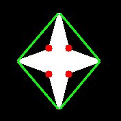

### Note of Opencv to Python

#### Opencv 在Pycharm中的配置

```python
pip install opencv-python
pip install opencv-contrib-python #扩展库
pip install pytesseract
```

新建python项目，注意解释器正确配置应该如下：


#### 常见图像坐标系

Opencv：


Matlab：


### 基本操作

#### 将照片读入到矩阵中，并显示

```python
src = cv.imread("D:/IMG_20161227_154705.jpg")
cv.imshow("input", src) #input为窗口名
cv.waitKey(0) 必须要有
cv.imwrite("D:/result.jpg", gray)
cv.waitKey(0)
cv.destroyAllWindows()
```

cv.IMREAD_COLOR：读入一副彩色图像，将其转换为BGR模式，图像的透明度会被忽略，这是默认参数。

cv.IMREAD_GRAYSCALE：以灰度模式读入图像

cv.IMREAD_UNCHANGED：读入一幅图像，并且包括图像的alpha 通道

 cv.IMREAD_ANYDEPTH ： 若设置返回相应深度图像（16位/32位），否则将其转换为8位

 IMREAD_LOAD_GDAL  ：使用gda驱动载入图像

可使用python自带的Matplotlib显示图像。但注意opencv为BGR，Matplotlib为RGB，被opencv的imread读入后，不能被Matplotlib显示.

imwrite要求图像为BGR或灰度格式，并且每个通道有一定的位，BMP每通道8位，PNG每通道8位/16位

#### 图像与原始字节之间的转换

```python
import os


randombytearray = bytearray(os.urandom(120000))  #生成含有随机字节的bytearray数组
nparray = np.array(randombytearray) #将其转换为numpy数组
grayimage = nparray.reshape((300, 400)) #生成单通道数组
bgrimage = nparray.reshape([100, 400, 3]) #生成三通道数组
src = np.random.randint(0, 255, 120000).reshape(300, 400)  #可随机生成numpy数组
print(src)
```

#### 窗口操作

```python
cv.namedWindow("input", cv.WINDOW_AUTOSIZE) 适应图片大小
cv.WINDOW_NORMAL 窗口大小可调节
CV_WINDOW_OPENGL 支持OpenGL
namedWindow()创建一个窗口。imshow可以直接指定窗口名，可以省去此函数（默认调用），但如果显示图像之前需要其他窗口操作时，需要调用此函数
destroyWindow() 关闭特定窗口 # cv.destroyWindow("video")
destroyAllWindows()关闭所有的HighGUI窗口
cv.startWindowThread() 
```

在调用cv.startWindowThread();后，即使没有调用waitKey()函数，图片也依然实时刷新。opencv的imshow()函数调用以后，并不立即刷新显示图片，而是等到waitKey()后才会刷新图片显示，所以cv.startWindowThread();是新开一个线程实时刷新图片显示。

#### waitKey函数

1.waitKey()返回的为-1(没有键被按下）或ASCII码值，

2.使用OpenCV的imshow函数显示图片，必须配合waitKey 函数使用，才能将图片显示在windows窗体上。否则，imshow 函数单独使用只能弹出空白窗体，而无法显示图片。

3.waitKey的时间延迟，只对Windows窗体有效，而且是 namedWindow 函数创造的OpenCV窗体，对于MFC或者Qt这种GUI窗体是否有效是一种未知结果,

<u>不设置参数</u>：特定的几毫秒之内，如果按下任意键，这个函数会返回按键的ASCII 码值，程序将会继续运行。如果没有键盘输入，返回值为-1

<u>ASCII码值</u>：0~127，共128个


<u>设置参数</u>：使用waitKey(0) （无限等待）来判断相应按键操作，若为64位电脑，则需设置为k=cv2.waitKey(0)&0xFF。

3.真正能起到程序暂停的作用的是我们熟悉的Windows API函数Sleep

```python
k = cv2.waitKey(0)&0xFF
if k == 27: # wait for ESC key to exit
	cv2.destroyAllWindows()
elif k == ord('s'): # wait for 's' key to save and exit
	cv2.imwrite('messigray.png',img)
	cv2.destroyAllWindows()
```

#### 视频与电脑摄像头输入、存储

```python
def video_demo(): #无输入值
	#capture = cv.VideoCapture("D:/IMG_9764.MP4") #0为读取电脑摄像头，读取的视频无声音，大小有限制
	capture = cv.VideoCapture(0) #0为设备索引号，自带摄像头一般为0
	# Define the codec and create VideoWriter object
	fourcc = cv.VideoWriter_fourcc(*'XVID')
	out = cv2.VideoWriter('output.avi',fourcc, 20.0, (640,480)) #编码类型，帧速率，帧大小
    if capture.isOpened() == 1:
        print("camera has been initialized correctly")
    elif capture.isOpened() == 0:
        print("camera has not been initialized correctly")
    ret, frame = capture.read()
	while(True):
		ret, frame = capture.read() #返回一个布尔值，若帧读取正确，则为True，每一帧
		frame1 = cv.flip(frame, 1) #镜像变换 1为左右 -1为上下
		frame2 = cv.transpose(frame) #顺时针旋转90°
		cv.imshow("video", frame) #每一帧循环显示
		cv.imshow("video1", frame1)
    	out.write(frame1)
    	print(capture.get(3)) #获取每一帧的宽度
		cv.imshow("video2", frame2)
		c = cv.waitKey(1) #响应用户操作
		#if c == 27:
			#break
    	#capture.release() #Closes video file or capturing device
    	if c & oxFF ==ord('q')
        	capture.release()
    		break
```

cv.VideoCapture为一个类,get(CV_CAP_PROP_FPS)可返回视频帧速率的准确值，但不能返回摄像头帧速率的准确值（总是返回0），可使用计时器来测量

视频写入时FourCC码以cv.FOURCC('M','J','P','G') 或者cv.FOURCC(*'MJPG'）传给fourcc，编码格式如下：

```
cv2.VideoWriter_fourcc('I','4','2','0'): This option is an
uncompressed YUV encoding, 4:2:0 chroma subsampled. This encoding is
widely compatible but produces large files. The file extension should be .avi.
• cv2.VideoWriter_fourcc('P','I','M','1'): This option is MPEG-1. The
file extension should be .avi.
• cv2.VideoWriter_fourcc('X','V','I','D'): This option is MPEG-4 and
a preferred option if you want the resulting video size to be average. The file
extension should be .avi.
• cv2.VideoWriter_fourcc('T','H','E','O'): This option is Ogg Vorbis.
The file extension should be .ogv.
• cv2.VideoWriter_fourcc('F','L','V','1'): This option is a Flash video.
The file extension should be .flv.
```

从文件播放视频时，使用cv.waiKey() 设置适当的持续时间，一般25ms合适，设置地高的话，视频播放地慢

<u>cap.read()</u>：若帧读取正确，返回True，检查其返回值判断视频文件是否到结尾

<u>cap.isOpened()</u>：摄像头成功初始化，返回True，否则使用cap.open()

<u>cap.get(propId)</u>：获得视频的参数信息，propId 可以是0 到18 之间的任何整数,见下表：

```python
• CV_CAP_PROP_POS_MSEC #Current position of the video file in milliseconds.
• CV_CAP_PROP_POS_FRAMES #0-based index of the frame to be decoded/captured next.
• CV_CAP_PROP_POS_AVI_RATIO #Relative position of the video file: 0 - start of the film, 1 - end of the film.
• CV_CAP_PROP_FRAME_WIDTH #Width of the frames in the video stream.
• CV_CAP_PROP_FRAME_HEIGHT #Height of the frames in the video stream.
• CV_CAP_PROP_FPS #Frame rate. 每秒帧数/帧速率/FPS
• CV_CAP_PROP_FOURCC #4-character code of codec.
• CV_CAP_PROP_FRAME_COUNT #Number of frames in the video file.
• CV_CAP_PROP_FORMAT #Format of the Mat objects returned by retrieve() .
• CV_CAP_PROP_MODE #Backend-specific value indicating the current capture mode.
• CV_CAP_PROP_BRIGHTNESS #Brightness of the image (only for cameras).
• CV_CAP_PROP_CONTRAST #Contrast of the image (only for cameras).
• CV_CAP_PROP_SATURATION #Saturation of the image (only for cameras).
• CV_CAP_PROP_HUE #Hue of the image (only for cameras).
• CV_CAP_PROP_GAIN #Gain of the image (only for cameras).
• CV_CAP_PROP_EXPOSURE #Exposure (only for cameras).
• CV_CAP_PROP_CONVERT_RGB #Boolean flags indicating whether images should be converted to RGB.
• CV_CAP_PROP_WHITE_BALANCE #Currently unsupported
• CV_CAP_PROP_RECTIFICATION #Rectification flag for stereocameras (note: only supported by DC1394 v 2.x backend currently)
```

cap.set(propId,value)：修改视频参数，value为新值

3—width，4—hight

使用一组摄像头时：

```python
success0 = cameraCapture0.grab()
success1 = cameraCapture1.grab()
if success0 and success1:
	frame0 = cameraCapture0.retrieve()
	frame1 = cameraCapture1.retrieve()
```


#### 获取图片的信息

```python
def get_image_info(image):
	print(type(image)) # <class 'numpy.ndarray'>
	print(image.shape) #显示高，宽，通道数
	print(image.size)  #总的像素数据大小=高*宽*通道数
	print(image.dtype)  #显示像素数据类型
	pixel_data = np.array(image)  #通过numpy获取像素值
	# print(pixel_data)
	print(image) 可以直接打印
```

#### 绘图功能

img：想要绘图的图像

color：BGR模式输入

thickness:默认为1，对于封闭图形设置为-1可实现填充

lineType：8连接，抗锯齿型连接（平滑性好，cv2.LINE_AA）

shift:坐标点与数轴的精度，默认为0

后五个参数的顺序一般如上

Drawing Line：

```python
img = np.zeros((512,512,3), np.uint8)
img = cv2.line(img,(0,0),(511,511),(255,0,0),5) #指定直线的起点和终点，画多条线时可用cv.polylines()
img = cv2.rectangle(img,(384,0),(510,128),(0,255,0),3) #指定矩形的左上顶点和右下顶点
img = cv2.circle(img,(447,63), 63, (0,0,255), -1) #指定圆心，半径
img = cv2.ellipse(img,(256,256),(100,50),0,0,180,(255, 0, 0),-1)
#img	=	cv.ellipse(	img, center, axes, angle, startAngle, endAngle, color[, thickness[, lineType[, shift]]]	)

pts = np.array([[10,5],[20,30],[70,20],[50,10]], np.int32)
pts = pts.reshape((-1,1,2)) #reshape 的第一个参数为-1, 表明这一维的长度是根据后面的维度的计算出来的。
img = cv2.polylines(img,[pts],True,(0,255,255)) #若为第三个参数为False，则该多边形不封闭，首尾不想连

font = cv2.FONT_HERSHEY_SIMPLEX
cv2.putText(img,'OpenCV',(10,500), font, 4,(255,255,255),2,cv2.LINE_AA) #位置，字体类型，字体大小，颜色，粗细，线条的类型
```


#### 鼠标操作响应

事件列表：


```python
# mouse callback function
def draw_circle(event,x,y,flags, param):
    if event == cv.EVENT_LBUTTONDBLCLK:
        cv.circle(img, [x, y], 10, (255, 0, 0), -1)


# Create a black image, a window and bind the function to window
img = np.zeros((512, 512, 3), np.uint8)
cv.namedWindow('image')
cv.setMouseCallback('image', draw_circle)
while(1):
    cv.imshow('image',img)
    if cv.waitKey(20) & 0xFF == 27:
        break
cv.destroyAllWindows()
```

通过按键来控制不同的鼠标事件响应：

```python
# 当鼠标按下时变为True
drawing = False
# 如果mode 为true 绘制矩形。按下'm' 变成绘制曲线。
mode = True
ix, iy = -1, -1


# 创建鼠标事件回调函数
def draw_circle(event,x,y,flags,param):
    global ix, iy, drawing, mode
# 当按下左键是返回起始位置坐标
    if event == cv.EVENT_LBUTTONDOWN:
        drawing=True
        ix, iy = x, y
# 当鼠标左键按下并移动是绘制图形。event 可以查看移动，flag 查看是否按下
    elif event == cv.EVENT_MOUSEMOVE and flags == cv.EVENT_FLAG_LBUTTON:
        if drawing == True:
            if mode == True:
                cv.rectangle(img,(ix,iy),(x,y),(0,255,0),-1)
            else:
                #cv.circle(img,(x,y),10,(0,0,255),-1) # 绘制圆圈，小圆点连在一起就成了线，3 代表了笔画的粗细
                # 下面注释掉的代码是起始点为圆心，起点到终点为半径的
                r=int(np.sqrt((x-ix)**2+(y-iy)**2))
                cv.circle(img,(ix,iy),r,(0,0,255),-1)
                # 当鼠标松开停止绘画。
    elif event == cv.EVENT_LBUTTONUP:
        drawing=False
        # if mode==True:
        #     cv.rectangle(img,(ix,iy),(x,y),(0,255,0),-1)
        # else:
        #     cv.circle(img,(x,y),5,(0,0,255),-1)


img = np.zeros((512, 512, 3), np.uint8)
cv.namedWindow('image')
cv.setMouseCallback('image',draw_circle)
while(1):
    cv.imshow('image', img)
    k = cv.waitKey(1) & 0xFF
    if k == ord('m'): #ord()可将字符转换为ASCII码
        mode = not mode
    elif k == 27:
        break
cv.destroyAllWindows()
```

opencv有限的事件处理能力与GUI处理能力，将其集成到其他应用程序框架更受欢迎

#### 滑动条的实现

```python
import cv2
import numpy as np


def nothing(x):
    pass
# 创建一副黑色图像
img=np.zeros((300,512,3),np.uint8)
cv2.namedWindow('image')
cv2.createTrackbar('R','image',0,255,nothing)
cv2.createTrackbar('G','image',0,255,nothing)
cv2.createTrackbar('B','image',0,255,nothing)
switch='0:OFF\n1:ON'
cv2.createTrackbar(switch,'image',0,1,nothing)
while(1):
    cv2.imshow('image',img)
    k=cv2.waitKey(1)&0xFF
    if k==27:
        break
    r=cv2.getTrackbarPos('R','image')
    g=cv2.getTrackbarPos('G','image')
    b=cv2.getTrackbarPos('B','image')
    s=cv2.getTrackbarPos(switch,'image')
    if s==0:
        img[:]=0
    else:
        img[:]=[b,g,r]
        #img = cv2.merge([b, g, r])
cv2.destroyAllWindows()
```

### 核心操作

####  色彩空间转换

```python
gray = cv.cvtColor(src, cv.COLOR_BGR2GRAY) #获取灰度图像
dst = cv.bitwise_not(image) # 通过逻辑非运算来获得负片
gray = cv.cvtColor(image, cv.COLOR_BGR2GRAY)
back_rgb = cv.cvtColor(gray, cv.COLOR_GRAY2BGR)
```

灰度：去除彩色信息将其转换成灰阶，对人脸检测等中间处理特别有效

HSV：H（Hue）色调，S(Saturation)饱和度，V（Value）表示黑暗程度或光谱另一端的明亮程度，便于色彩区分 ，opencv中将hue值设为0-180，便于用uint8表示

####  Print函数Tips

```python
打印变量值
print("width : %s, height : %s channels : %s" % (width, height, channels))
打印矩阵
print(image)
```

#### 遍历像素点

```python
def access_pixels(image):
	height = image.shape[0]
	width = image.shape[1]
	channels = image.shape[2]
	print("width : %s, height : %s channels : %s" % (width, height, channels))
	for row in range(height):
		for col in range(width):
			for c in range(channels):
				pv = image[row, col, c]
				image[row, col, c] = 255 – pv        
	cv.imshow("demo", image)
```

优先使用索引等方法对像素点、面进行操作，使用循环会使得效率低下，尤其对于视频处理

#### 矩阵操纵（创建一幅图像)

ones创建任意维度和元素个数的数组，其元素值均为1
empty一样，只是它所常见的数组内所有元素均为空

```python
zeros([m,n…],int8) 创建任意维度和元素个数的数组，其元素值均为0
img = np.zeros([400, 400, 3], np.uint8)
#img = np.ones([400, 400, 3]) * 255
# img[:, :, 2] = np.ones([400, 400])*255 #对2通道像素平面进行操作
# cv.imshow("new image", img)
matrix = np.ones([6, 6], np.float32) # 有浮点数计算一定选float
```

fill用来填充矩阵，
reshape可以进行矩阵重组，元素数相同

```python
matrix.fill(1625.35) 
```

cv.convertScaleAbs() 可以将浮点数转化为uint8 ，负数转换为绝对值

```python
m2 = matrix.reshape([3, 12]) 
```

array生成任意矩阵，可以作为算子

```
m3 = np.array([[1,2,3], [4,5,6], [7,8,9]],np.int32)
```


####  获取程序执行时间

```python
t1 = cv.getTickCount()
create_image() #程序
t2 = cv.getTickCount()
time = (t2 - t1) / cv.getTickFrequency()
print("time = %s ms" % (time * 1000))
```

可以通过调用opencv自带的API来减少程序执行时间

####  提取某颜色对应的像素

思路：转换到HSV空间，再参考下表设置inRange函数的参数(红色设置为第二列较佳)


```python
def extract_object_demo():
	capture = cv.VideoCapture("D:/IMG_9764.MP4")
	while(True):
		ret, frame = capture.read() # 先将每一帧读入
	if ret == False:
		break
	hsv = cv.cvtColor(frame, cv.COLOR_BGR2HSV)  
	lower_hsv = np.array([0, 43, 46]) # 找出白色
	upper_hsv = np.array([10, 255, 255])
	mask = cv.inRange(hsv, lowerb=lower_hsv, upperb=upper_hsv)
	dst = cv.bitwise_and(frame, frame, mask=mask)
	cv.imshow("video", frame)
	cv.imshow("mask", dst) #将含有红色的像素提取以红色在黑色视频中显示 
	c = cv.waitKey(50)
	if c == 27:
		break  # escape
```

####  图像通道的合并、分离、单通道操作、单像素操作

```python
b, g, r = cv.split(src)
cv.imshow("blue", b)
cv.imshow("green", g)
cv.imshow("red", r)
src = cv.merge([b, g, r]) # 注意此处的输入
src[:, :, 0] = 0
src.itemset((150, 120, 0), 255) #将蓝色通道值变为255
print(src.itemset((150, 120, 0)))
cv.imshow("changed image", src)
h, w = src.shape[0:2] #获取图像的高与宽，0可以不输入
print(src[30, 30, :]) #打印某位置上的三个像素值
```

#### 图像算术运算、逻辑运算

```python
dst = cv.add(m1, m2) #相加
dst = cv.subtract(m1, m2) #相减
dst = cv.divide(m1, m2) #除
dst = cv.multiply(m1, m2) #乘
M1 = cv.mean(m1) #获取均值
M2, dev2 = cv.meanStdDev(m2) #获取均值和方差
Tips：方差越小，则该图片包含的信息越少，可设置阈值来过滤无意义的图片
dst1 = cv.bitwise_or(m1, m2)
dst2 = cv.bitwise_and(m1, m2) # 可以作为一个“遮罩”
dst3 = cv.bitwise_not(m1) #获得负片
```


####  调整对比度和亮度

```python
def contrast_brightness_demo(image, c, b):
	h, w, ch = image.shape #取出shape的前两位【：2】
	blank = np.zeros([h, w, ch], image.dtype)
	dst = cv.addWeighted(image, c, blank, 1-c, b) #调整对比度和亮度,none的均可以接收，dst = 	src1*alpha + src2*beta + gamma
	cv.imshow("con_bri_demo", dst)
像素运算式：dst = src1*alpha + src2*beta + gamma
```

#### ROI选择

```python
face = src[50:250, 100:300] # [height, width]
gray = cv.cvtColor(face, cv.COLOR_BGR2GRAY)
backrgb = cv.cvtColor(gray, cv.COLOR_GRAY2BGR)
src[50:250, 100:300] = backrgb
cv.imshow("face", src)
```

### 图像处理

#### 泛洪填充

```python
def fill_color_demo(image):
	copyImg = image.copy()
	h, w = image.shape[:2]
	mask = np.zeros([h+2, w+2], np.uint8) #底层代码要求必须这么写
	cv.floodFill(copyImg, mask, (30, 30), (0, 255, 255), (100, 100, 100), (50, 50, 50), 	cv.FLOODFILL_FIXED_RANGE)
	cv.imshow("fill_color_demo", copyImg)
```


```python
def fill_binary():
	image = np.zeros([400, 400, 3], np.uint8)
	image[100:300, 100:300, :] = 255
	cv.imshow("fill_binary", image)
	mask = np.ones([402, 402, 1], np.uint8)
	mask[100:300, 100:300] = 0
	cv.floodFill(image, mask, (200, 200), (255, 255, 0), cv.FLOODFILL_MASK_ONLY)#只填充mask标记为（0，0）的像素点
	cv.imshow("filled binary", image)
```

####  图像模糊（图像平滑）

##### 概述

低通滤波：去噪，模糊图像，但去除了高频成分（噪声、边界）

高通滤波（图像梯度）：找到边缘

空间滤波的数学原理:二维空间卷积

##### 分类及应用场景

平均：卷积框覆盖区域所有像素的平均值来代替中心元素

高斯(低通滤波器之一）：方框中心的值最大，其余方框根据距离中心元素的距离递减，构成一个高斯小山包。原来的求平均数现在变成求加权平均数，权就是方框里的值，X与y方向的标准差相等，若设置为0，则函数根据核的大小自动计算

```python
# 0是指根据窗口大小（5,5）来计算高斯函数标准差
blur = cv2.GaussianBlur(img,(5,5),0)
```

只考虑像素之间的空间关系，而不会考虑像素值之间的关系（像素的相似度）

中值：用与卷积框对应像素的中值来替代中心像素的值，去除椒盐噪声、数字化的视频噪声尤其是彩色图像的噪声，但对于较大ksize，代价较高

双边：保持边界清晰的情况下有效的去除噪音，使用空间高斯权重（位置差异越小权重越大）与灰度值相似性高斯权重（灰度值差异越小权重越大）,边缘处灰度值与中心像素灰度值相比变化大，权重小不会被模糊

```python
# 9是邻域直径，两个75分别是空间高斯函数标准差，灰度值相似性高斯函数标准差
blur = cv2.bilateralFilter(img,9,75,75)
```

关于算子：元素个数为奇数（奇数行奇数列），<u>总和为0</u>：进行边缘和梯度计算，

<u>总和为1</u>：进行增强锐化等，相当于将感兴趣像素与其邻近像素值间的差放大，图像的亮度没有改变
Tips：blurry模糊的，不清楚的，污脏的


```python
dst = cv.blur(image, (1, 15)) #均值模糊，模糊只是卷积的表象
dst = cv.medianBlur(image, 5) #中值模糊
def custom_blur_demo(image): #自定义卷积核来模糊
	# kernel = np.ones([5, 5], np.float32)/25 #最多25个255，防止溢出
	kernel = np.array([[0, -1, 0], [-1, 5, -1], [0, -1, 0]], np.float32)
	dst = cv.filter2D(image, -1, kernel=kernel) #-1表示目标图像与源图像的位深度相同
	cv.imshow("custom_blur_demo" ,dst)
```

filter2D()对每个通道使用相同的核，若要每个通道的核不同，则使用split分离通道，再用merge合并

```python
from scipy import ndimage


kernel_3x3 = np.array([[-1, -1, -1],
                   [-1,  8, -1],
                   [-1, -1, -1]])
k3 = ndimage.convolve(img, kernel_3x3) #通过numpy的ndimage的convolve可以实现两个矩阵之间的卷积
```

#### 图像梯度

二维函数的梯度定义为向量,其幅度即模如下：
$$
\begin{array}{c}{\nabla \boldsymbol{f}=\left[\begin{array}{c}{g_{x}} \\ {g_{y}}\end{array}\right]=\left[\begin{array}{c}{\frac{\partial f}{\partial x}} \\ {\frac{\partial f}{\partial y}}\end{array}\right]} \\ {\nabla f=\operatorname{mag}(\nabla \boldsymbol{f})=\left[\begin{array}{c}{x_{x}^{2}+g_{y}^{2}}\end{array}\right]^{1 / 2}=\left[(\partial f / \partial x)^{2}+(\partial f / \partial y)^{2}\right]^{1 / 2}}\end{array}
$$
可由绝对值来近似：
$$
\nabla f \approx\left|g_{x}\right|+\left|g_{y}\right|
$$

离散化表示：
$$
\begin{aligned} g_{x} &=\frac{\partial f(x, y)}{\partial x}= f(x+1, y)-f(x, y) \\ g_{y} &=\frac{\partial f(x, y)}{\partial y}= f(x, y+1)-f(x, y) \end{aligned}
$$

##### Laplacian 算子

可用来计算图像的二阶导数，推导在Matlab图像坐标系下进行：
$$
\begin{array}{c}{\nabla^{2} f(x, y)=\frac{\partial^{2} f(x, y)}{\partial x^{2}}+\frac{\partial^{2} f(x, y)}{\partial y^{2}}} \\ {\frac{\partial^{2} f(x, y)}{\partial x^{2}}=f(x+1, y)+f(x-1, y)-2 f(x, y)} \\ {\frac{\partial^{2} f(x, y)}{\partial y^{2}}=f(x, y+1)+f(x, y-1)-2 f(x, y)}  \\{\nabla^{2} f(x, y)=[f(x+1, y)+f(x-1, y)+f(x, y+1)+f(x, y-1)]-4 f(x, y)}\end{array}
$$

$$
\begin{array}{ccc}{0} & {1} & {0} \\ {-1} & {-4} & {1} \\ {0} & {1} & {0} \\ \\ {1} & {1} & {1} \\ {1} & {-8} & {1} \\ {1} & {1} & {1}\end{array}
$$

第二个算子为考虑了对角线元素的效果

```
#cv2.CV_64F 输出图像的深度（数据类型），可以使用-1, 与原图像保持一致np.uint8
laplacian=cv2.Laplacian(img,cv2.CV_64F)
```

##### Prewitt算子

$$
\begin{array}{l}{g_{x}=\frac{\partial f}{\partial x}=\left(z_{7}+z_{8}+z_{9}\right)-\left(z_{1}+z_{2}+z_{3}\right)} \\ {g_{y}=\frac{\partial f}{\partial y}=\left(z_{3}+z_{6}+z_{9}\right)-\left(z_{1}+z_{4}+z_{7}\right)}\end{array}
$$

对角线方向：
$$
\begin{array}{l}{g_{x}^{\prime}=\left(z_{2}+z_{3}+z_{6}\right)-\left(z_{4}+z_{7}+z_{8}\right)} \\ {g_{y}^{\prime}=\left(z_{6}+z_{8}+z_{9}\right)-\left(z_{1}+z_{2}+z_{4}\right)}\end{array}
$$


##### Sobel算子和Scharr算子

Sobel 算子是高斯平滑与微分操作的结合体，所以它的抗噪声能力很好。你可以设定求导的方向（xorder 或yorder）。还可以设定使用的卷积核的大小（ksize）。如果ksize=-1，会使用3x3 的Scharr 滤波器，它的的效果要比3x3 的Sobel 滤波器好（而且速度相同，所以在使用3x3 滤波器时应该尽量使用Scharr 滤波器）。3x3 的

Sobel算子的卷积核：
$$
\begin{array}{l}{g_{x}=\frac{\partial f}{\partial x}=\left(z_{7}+2 z_{8}+z_{9}\right)-\left(z_{1}+2 z_{2}+z_{3}\right)} \\ {g_{y}=\frac{\partial f}{\partial y}=\left(z_{3}+2 z_{6}+z_{9}\right)-\left(z_{1}+2 z_{4}+z_{7}\right)}\end{array}
$$


Scharr 滤波器卷积核如下：

X方向：
$$
\begin{array}{|c|c|c|}\hline-3 & {0} & {3} \\ \hline-10 & {0} & {10} \\ \hline-3 & {0} & {3} \\ \hline\end{array}
$$
Y方向：
$$
\begin{array}{|c|c|c|}\hline-3 & {-10} & {-3} \\ \hline 0 & {0} & {0} \\ \hline 3 & {10} & {3} \\ \hline\end{array}
$$


```python
# 参数1,0 为只在x 方向求一阶导数，最大可以求2 阶导数。
sobelx=cv2.Sobel(img,cv2.CV_64F,1,0,ksize=5)
# 参数0,1 为只在y 方向求一阶导数，最大可以求2 阶导数。
sobely=cv2.Sobel(img,cv2.CV_64F,0,1,ksize=5)
```

当我们可以通过参数 -1 来设定输出图像的深度（数据类型）与原图像保持一致，但是我们在代码中使用的却是 cv2.CV_64F。这是为什么呢？想象一下一个从黑到白的边界的导数是正数，而一个从白到黑的边界点导数却是负数。如果原图像的深度是np.int8 时，所有的负值都会被截断变成 0，换句话说就是把把边界丢失掉。所以如果这两种边界你都想检测到，最好的的办法就是将输出的数据类型设置的更高，比如 cv2.CV_16S，cv2.CV_64F 等。取绝对值然后再把它转回到 cv2.CV_8U

```python
# Output dtype = cv2.CV_8U
sobelx8u = cv2.Sobel(img,cv2.CV_8U,1,0,ksize=5)# 也可以将参数设为-1
#sobelx8u = cv2.Sobel(img,-1,1,0,ksize=5)
# Output dtype = cv2.CV_64F. Then take its absolute and convert to cv2.CV_8U
sobelx64f = cv2.Sobel(img,cv2.CV_64F,1,0,ksize=5)
abs_sobel64f = np.absolute(sobelx64f)
sobel_8u = np.uint8(abs_sobel64f)
```

#### 边缘检测

Laplacian(),sobel,scharr等会将噪声错误地识别为边缘，故在此之前应进行中值滤波和灰度化

核的元素值之和为0，将边缘转为白色，非边缘转为黑色

##### Canny边缘检测

John F.Canny 在1986 年提出的，分为以下五步：

1. 使用高斯滤波器去噪

2. 使用Sobel算子计算水平方向和垂直方向梯度，找到边界的梯度和方向
   $$
   \begin{array}{c}{\text { Edge-Gradient }(G)=\sqrt{G_{x}^{2}+G_{y}^{2}}} \\ {\text { Angle }(\theta)=\tan ^{-1}\left(\frac{G_{x}}{G_{y}}\right)}\end{array}
   $$

   梯度的方向一般总是与边界垂直。梯度方向被归为四类：垂直，水平，和两个对角线

3.在边缘上使用非最大抑制（NMS）

在获得梯度的方向和大小之后，应该对整幅图像做一个扫描，去除那些非边界上的点。对每一个像素进行检查，看这个点的梯度是不是周围具有相同梯度方向的点中最大的。

4.检测到的边缘上使用双阈值去除假阳性：

当图像的灰度梯度高于maxVal 时被认为是真的边界，那些低于minVal 的边界会被抛弃。如果介于两者之间的话，就要看这个点是否与某个被确定为真正的边界点相连，如果是就认为它也是边界点，如果不是就抛弃


5.分析所有边缘及其间的连接，保留真正的边缘，消除不明显的边缘

函数实现:cv2.Canny()

第一个参数是输入图像。第二和第三个分别是minVal 和maxVal。第三个参数设置用来计算图像梯度的Sobel
卷积核的大小，默认值为3。最后一个参数是L2gradient，它可以用来设定求梯度大小的方程。若为True，平方和开根号，若为False，用绝对值之和来近似，默认为False。

```python
img=cv2.Canny(img, 50, 150, apertureSize=3, L2gradient=True)
```

用滑动条观看阈值对检测效果的影响：

```python
# something wrong
def nothing(x):
     pass

img = cv2.imread("../images/statue_small.jpg", 1)

cv2.namedWindow('canny')
cv2.createTrackbar('minval','canny',0,255, nothing)
cv2.createTrackbar('maxval','canny',0,255, nothing)
while(1):
    minval = cv2.getTrackbarPos('minval','canny')
    maxval = cv2.getTrackbarPos('maxval','canny')
    canny = cv2.Canny(img, minval, maxval)
    cv2.imshow("image", img)
    cv2.imshow("canny", canny)
    k = cv2.waitKey(0)
    if k == 27:
        break
cv2.destroyAllWindows()
```

#### 轮廓检测

轮廓可以简单认为成将连续的点（连着边界）连在一起的曲线，具有相同的**颜色或者灰度**。轮廓在形状分析和物体的检测和识别中很有用。注意：

1. 为更加准确，寻找轮廓前，进行阈值化或canny边缘检测
2. `cv2.findContours()`会修改原始图像，若后续想使用原始图像，应使用`copyImg = image.copy()`
3. 查找轮廓是在黑色背景中找白色物体

##### 应用

计算多边形边界、形状逼近、计算感兴趣区域

在opencv4中`cv2.findContours`**输入**：第一个是输入图像，第二个是轮廓检索模式，第三个是轮廓近似方法，`cv2.CHAIN_APPROX_NONE`所有边界点均被存储，`cv2.CHAIN_APPROX_SIMPLE`去掉轮廓上的冗余点。压缩轮廓，减少内存开支

**返回**：只返回轮廓（python列表，每个元素为一个numpy数组）、轮廓的层析结构、不返回图像

##### 轮廓的绘制

`cv2.drawContours()`输入：原始图像、轮廓、轮廓的索引（设置为-1时绘制所有轮廓、轮廓的颜色、轮廓的厚度，输出：图像

```python
#bugs:不能读取jpg、JPEG文件，文件路径采用/不要用\
import numpy as np
import cv2.cv2
im = cv2.imread('D:/opencv_imagedata/data/shape_binary.png')
imgray = cv2.cvtColor(im,cv2.COLOR_BGR2GRAY)
ret,thresh = cv2.threshold(imgray,127,255,0)
contours, hierarchy = cv2.findContours(thresh,cv2.RETR_TREE,cv2.CHAIN_APPROX_NONE)
img1 = cv2.drawContours(im, contours, -1, (255,0,0), 3)
img2 = cv2.drawContours(im, contours, 3, (0,255,0), 3)
cv2.imshow("img2",img2)
cv2.waitKey()
cv2.destroyAllWindows()
```

##### 轮廓特征

###### 矩

```
cnt = contours[0]
M = cv2.moments(cnt)
print(M)
cx = int(M['m10']/M['m00'])
cy = int(M['m01']/M['m00'])
```

根据这些矩的值，我们可以计算出对象的重心:
$$
C_{x}=\frac{M_{10}}{M_{00}}, \quad C_{y}=\frac{M_{01}}{M_{00}}
$$

###### 轮廓面积

```
area = M['m00']
area = cv2.contourArea(cnt)
```

###### 轮廓周长

```
perimeter = cv2.arcLength(cnt,True)
```

###### 轮廓近似

```python
epsilon = 0.1*cv2.arcLength(cnt,True)
approx = cv2.approxPolyDP(cnt,epsilon,True)
img3 = cv2.drawContours(im, approx, 0, (0, 255, 0), 3)
```

`cv2.approxPolyDP`输入：轮廓、原轮廓与近似多边形周长的最大差值，输出与输入曲线类型相同的曲线

###### 凸包

与轮廓近似相似凸性缺陷：一般来说，凸性曲线总是凸出来的，至少是平的。如果有地方凹进去了就被叫做凸性缺陷

```
hull = cv2.convexHull(points[, hull[, clockwise[, returnPoints]]
```

输入：

```
points 我们要传入的轮廓
hull 输出，通常不需要
clockwise 方向标志。如果设置为True，输出的凸包是顺时针方向的。
否则为逆时针方向。
returnPoints 默认值为True。它会返回凸包上点的坐标。如果设置
为False，就会返回与凸包点对应的轮廓上的点。
```

```
hull = cv2.convexHull(cnt)
```

如`returnPoints`设置为`true`返回`[[[234 202]], [[ 51 202]], [[ 51 79]], [[234 79]]]`;设置为`False`返回`[[129],[ 67],[ 0],[142]]`,可认为是`cnt`这个列表的索引

###### 凸性检测

```python
k = cv2.isContourConvex(cnt)
```

返回一个布尔值

###### 边界矩形

**直边界矩形**：没有旋转的矩形，矩形面积非最小

```
x,y,w,h = cv2.boundingRect(cnt)
img = cv2.rectangle(img,(x,y),(x+w,y+h),(0,255,0),2)
```

**旋转的边界矩形**

考虑了对象的旋转，矩形面积最小，`cv2.minAreaRect()`返回的是一个Box2D 结构，其中包含矩形左上角角点的坐标（x，y），矩形的宽和高（w，h），以及旋转角度。

```
for c in contours:
  # find bounding box coordinates
  x,y,w,h = cv2.boundingRect(cnt)
  cv2.rectangle(img, (x,y), (x+w, y+h), (0, 255, 0), 2)
  # find minimum area
  rect = cv2.minAreaRect(cnt)
  # calculate coordinates of the minimum area rectangle
  box = cv2.boxPoints(rect)
  # normalize coordinates to integers
  box = np.int0(box)
  # draw contours
  cv2.drawContours(img, [box], 0, (0,0, 255), 3)
```

###### 最小闭圆（最小外接圆）

找到一个轮廓的外切圆

```python
(x,y),radius = cv2.minEnclosingCircle(cnt)
center = (int(x),int(y))
radius = int(radius)
img = cv2.circle(img,center,radius,(0,255,0),2)
```

###### 椭圆拟合

返回旋转边界矩形的内切椭圆

```
ellipse = cv2.fitEllipse(cnt)
img = cv2.ellipse(im,ellipse,(0,255,0),2)
```

###### 直线拟合

根据轮廓上的点来拟合一条直线

```python
[vx,vy,x,y] = cv2.fitLine(cnt, cv2.DIST_L2,0,0.01,0.01)
rows, cols = im.shape[:2]
lefty = int((-x*vy/vx) + y)
righty = int(((cols-x)*vy/vx)+y)
img4 = cv2.line(im,(cols-1,righty),(0,lefty),(0,255,0),2)
```

##### 轮廓的性质

```python
#长宽比：边界矩形的宽高比
x,y,w,h = cv2.boundingRect(cnt)
aspect_ratio = float(w)/h
#Extent：轮廓面积与边界矩形面积的比
area = cv2.contourArea(cnt)
rect_area = w*h
extent = float(area)/rect_area
#Solidity：轮廓面积与凸包面积的比
hull = cv2.convexHull(cnt)
hull_area = cv2.contourArea(hull)
solidity = float(area)/hull_area
#Equivalent Diameter（当量直径）：与轮廓面积相等的圆形的直径
equi_diameter = np.sqrt(4*area/np.pi)
#方向：对象的方向，下面的方法还会返回长轴和短轴的长度
(x,y),(MA,ma),angle = cv2.fitEllipse(cnt)
#获取以轮廓包围区域为掩模的方法1：
mask = np.zeros(imgray.shape,np.uint8)
cv2.drawContours(mask,[cnt],0,255,-1) # 这里一定要使用参数-1, 绘制填充的的轮廓
pixelpoints = np.transpose(np.nonzero(mask)) #找到非零元素的坐标再取对角
pixelpoints = cv2.findNonZero(mask)
#原图像中轮廓对应的区域像素极值及其位置，以mask作为一个掩模
min_val, max_val, min_loc, max_loc = cv2.minMaxLoc(im,mask = mask)
#平均颜色
mean_color = cv2.mean(im,mask = mask)
#平均灰度
mean_graylevel = cv2.mean(im,mask = mask)
#获取轮廓的极点
leftmost = tuple(cnt[cnt[:,:,0].argmin()][0])
rightmost = tuple(cnt[cnt[:,:,0].argmax()][0])
topmost = tuple(cnt[cnt[:,:,1].argmin()][0])
bottommost = tuple(cnt[cnt[:,:,1].argmax()][0])
```

##### 凸缺陷

`cv2.convexityDefects`返回每个凸缺陷的[起点，终点，最远的点，到最
远点的近似距离]，注意前三个值均为轮廓点的索引

```python
import cv2
import numpy as np
img = cv2.imread('star.jpg')
img_gray = cv2.cvtColor(img,cv2.COLOR_BGR2GRAY)
ret, thresh = cv2.threshold(img_gray, 127, 255,0)
contours,hierarchy = cv2.findContours(thresh,2,1)
cnt = contours[0]
hull = cv2.convexHull(cnt,returnPoints = False)
defects = cv2.convexityDefects(cnt,hull)
#为何要这样索引？
for i in range(defects.shape[0]):
	s,e,f,d = defects[i,0]
	start = tuple(cnt[s][0])
	end = tuple(cnt[e][0])
	far = tuple(cnt[f][0])
	cv2.line(img,start,end,[0,255,0],2)
	cv2.circle(img,far,5,[0,0,255],-1)
cv2.imshow('img',img)
cv2.waitKey(0)
cv2.destroyAllWindows()
```



##### 点与轮廓间的距离

求解图像中的一个点到一个对象轮廓的最短距离。如果点在轮廓的外部，返回值为负。如果在轮廓上，返回值为0。如果在轮廓内部，返回值为正。

第三个参数是measureDist。如果设置为True，就会计算最短距离。如果是False，只会判断这个点与轮廓之间的位置关系（返回值为+1，-1，0）

```
dist = cv2.pointPolygonTest(cnt,(50,50),True)
```

##### 形状匹配

`cv2.matchShape()`比较两个形状或轮廓的相似度，返回值越小匹配越好

原理：Hu矩：Hu 矩是归一化中心矩的线性组合，之所以这样做是为了能够获取代表图像的某个特征的矩函数，这些矩函数对某些变化如缩放，旋转，镜像映射（除了h1）具有不变形

```python
ret = cv2.matchShapes(cnt1,cnt2,1,0.0)
```

##### 轮廓的层次结构

一个形状在另外一个形状的内部，外部的形状为父，内部的形状为子

###### opencv中的层次结构

使用一个数组表示：`[Next，Previous，First_Child，Parent]`，分别表示同级下一个轮廓、同级前一个轮廓、第一个子轮廓、父轮廓，没有时为-1，顺序：从上到下，从左到右

###### 轮廓检索方式

1. `RETR_LIST`,只是提取所有的轮廓，而不去创建任何父子关系,所有轮廓在同一级别
2. `RETR_EXTERNAL`,只会返回最外边的的轮廓，所有的子轮廓都会被忽略掉
3. `RETR_CCOMP`返回所有轮廓，分为两极组织结构，一副黑底白字的图像，图像中是数字0。0 的外边界属于第一级组织结构，0 的内部属于第2 级组织结构
4. `RETR_TREE`返回所有轮廓，创建完整的组织结构列表

#### 图像阈值

##### 简单阈值

cv2.threshhold()：

- 第一个参数就是原图像，原图像应该是灰度图

- 第二个参数就是用来对像素值进行分类的阈值

- 第三个参数就是当像素值高于（有时是小于）阈值时应该被赋予的新的像素值

- 第四个参数表示阈值方法

  cv2.THRESH_BINARY：
  $$
  \operatorname{dst}(x, y)=\left\{\begin{array}{c}{\text { maxval } i f \operatorname{src}(x, y)>\text { thresh }} \\ {0 \text { otherwise }}\end{array}\right.
  $$
  cv2.THRESH_BINARY_INV：
  $$
  \operatorname{dst}(x, y)=\left\{\begin{array}{c}{0 \text { if } \operatorname{src}(x, y)>\text { thresh }} \\ {\text { maxval otherwise }}\end{array}\right.
  $$
  cv2.THRESH_TRUNC：
  $$
  \operatorname{dst}(x, y)=\left\{\begin{array}{c}{\text { threshold } i f \operatorname{src}(x, y)>\text { thresh }} \\ {\operatorname{src}(x, y) \text { otherwise }}\end{array}\right.
  $$
  cv2.THRESH_TOZERO：
  $$
  \operatorname{dst}(x, y)=\left\{\begin{array}{c}{\operatorname{src}(x, y) \text { if } \operatorname{src}(x, y)>\text { thresh }} \\ {0 \text { otherwise }}\end{array}\right.
  $$
  cv2.THRESH_TOZERO_INV：
  $$
  \operatorname{dst}(x, y)=\left\{\begin{array}{c}{0 \text { if } \operatorname{src}(x, y)>\text { thresh }} \\ {\operatorname{src}(x, y) \text { otherwise }}\end{array}\right.
  $$

例如：

```python
import cv2
import numpy as np
from matplotlib import pyplot as plt
img=cv2.imread('gradient.png',0)
ret,thresh1=cv2.threshold(img,127,255,cv2.THRESH_BINARY)
ret,thresh2=cv2.threshold(img,127,255,cv2.THRESH_BINARY_INV)
ret,thresh3=cv2.threshold(img,127,255,cv2.THRESH_TRUNC)
ret,thresh4=cv2.threshold(img,127,255,cv2.THRESH_TOZERO)
ret,thresh5=cv2.threshold(img,127,255,cv2.THRESH_TOZERO_INV)
titles = ['Original Image','BINARY','BINARY_INV','TRUNC','TOZERO','TOZERO_INV']
images = [img, thresh1, thresh2, thresh3, thresh4, thresh5]
for i in xrange(6):
	plt.subplot(2,3,i+1),plt.imshow(images[i],'gray')
	plt.title(titles[i])
	plt.xticks([]),plt.yticks([])
plt.show()
```


#### 使用git, Typora，github创建笔记

```
ssh-keygen -t rsa -C "youremail@example.com" #设置秘钥
github上添加秘钥
git config --global user.email "you@example.com"
git config --global user.name "Your Name"
git init #初始化该文件夹
git status #获取当前git状态
git diff #获取文件更改内容
git log #查看修改记录

git remote add origin git@github.com:perfectism13/learning.git #关联本地与远程仓库
git push -u origin master
git pull git@github.com:perfectism13/learning.git
git add . #ubantu中为./
git commit -m "information of update"
git push git@github.com:perfectism13/learning.git
```

[](https://www.cnblogs.com/fanyong/p/3424501.html)

[](https://blog.csdn.net/ajianyingxiaoqinghan/article/details/70544159)

windows中的ssh key在c/users/闵晨阳1998/.ssh中

ubantu在home/.ssh中

#### 在matlab中使用hough变换检测圆

##### 1.编程思路

1.读入图像，并将其灰度化

2.利用canny算子来检测边缘

3.设定检测时的半径与角度步长，预估被检测圆的半径范围

4.通过圆的参数方程将图像空间(x,y)对应到参数空间(a,b,r)

5.求解半径和圆心

6.合并圆心临近，半径差别不大的圆

7.标记出检测到的圆，并输出圆心坐标和半径

##### 2.代码实现

```matlab
%author：minchenyang
image = imread('D:/opencv_imagedata/detect_blob.png');  
figure(1),imshow(image),title('原图')
% 将原图灰度化
image = rgb2gray(image); 
figure(2),imshow(image),title('灰度化的原图')  
%采用canny算子来进行边缘检测
edgeimage = edge(image, 'Canny', [0.3, 0.35]); 
% 设定检测时的半径与角度步长
step_r = 1;step_angle = 0.1; 
%预估被检测圆的半径范围
rmin = 10;  rmax = 100; 
% 自动取最优的灰度阈值
thresh = graythresh(image);  
r_min = rmin;r_max = rmax;
element=[];  para=[];  
p=0.6;%p=thresh
[h,w] = size(edgeimage);  
size_r = round((rmax-rmin)/step_r)+1; 
size_angle = round(2*pi/step_angle);  
hough_space = zeros(h,w,size_r);  
%查找二值图像中非零元素的行列坐标  
[row,col] = find(edgeimage);
count = size(row);  
%通过圆的参数方程将图像空间(x,y)对应到参数空间(a,b,r)  
for i=1:count  
    for r=1:size_r  
        for k=1:size_angle
            a = round(row(i)-(r_min+(r-1)*step_r)*cos(k*step_angle)); % a=x-r*cos(angle)  
            b = round(col(i)-(r_min+(r-1)*step_r)*sin(k*step_angle)); % b=y-r*sin(angle)   
            if(a>0&&a<=h&&b>0&&b<w)  
                hough_space(a,b,r) = hough_space(a,b,r)+1; 
            end  
        end  
    end  
end  
% 搜索超过阈值的聚集点
max_para = max(max(max(hough_space)));
num = find(hough_space>=max_para*p);  
length = size(num);  
%求解半径和圆心  
for i=1:count  
    for k=1:length  
        para3 = floor(num(k)/(h*w))+1; 
        para2 = floor((num(k)-(para3-1)*(h*w))/h)+1; 
        para1 = num(k)-(para3-1)*(h*w)-(para2-1)*h;
        if((row(i)-para1)^2+(col(i)-para2)^2<(r_min+(para3-1)*step_r)^2+5&&...  
                (row(i)-para1)^2+(col(i)-para2)^2>(r_min+(para3-1)*step_r)^2-5)  
            hough_circle(row(i),col(i)) = true;  
        end  
    end  
end
for k=1:length  
    para3 = floor(num(k)/(h*w))+1;
    para2 = floor((num(k)-(para3-1)*(h*w))/h)+1;  
    para1 = num(k)-(para3-1)*(h*w)-(para2-1)*h;  
    element = [element;para1,para2,para3];  
    hough_circle(para1,para2)= true;  
end  
%合并圆心临近，半径差别不大的圆 
while size(element,1) >= 1  
    num=1;  
    xyr=[];  
    temp1=element(1,1);temp2=element(1,2);temp3=element(1,3);  
    c1=temp1;c2=temp2;c3=temp3;  
    temp3= r_min+(temp3-1)*step_r;  
    if size(element,1)>1       
        for k=2:size(element,1)  
          if (element(k,1)-temp1)^2+(element(k,2)-temp2)^2 > temp3^2  
             xyr=[xyr;element(k,1),element(k,2),element(k,3)];  %保存剩下圆的圆心和半径位置  
          else    
            c1=c1+element(k,1);  
            c2=c2+element(k,2);  
            c3=c3+element(k,3);  
            num=num+1;  
          end   
        end  
    end   
    c1=round(c1/num);  
    c2=round(c2/num);  
    c3=round(c3/num);  
    c3=r_min+(c3-1)*step_r;      
    para=[para;c1,c2,c3]; %保存各个圆的圆心和半径的值  
    element=xyr;
end
figure(3),imshow(edgeimage),title('边缘')  
figure(4),imshow(hough_circle),title('检测出的圆上的像素点')  
element=para;  
%标记出检测到的圆，并输出圆心坐标和半径  
[r,~]=size(element);  
fprintf(1,'  检测出%d个圆\n',r);  
fprintf(1,'  圆心     半径\n'); 
for w=1:r  
        fprintf(1,'%d （%d，%d）  %d\n',w,floor(element(w,1)),floor(element(w,2)),floor(element(w,3))); 
end   
figure(5),imshow(image),title('检测出图中的圆')  
hold on;  
plot(element(:,2), element(:,1), 'r+');  
for k = 1 : r   
    t=0:0.01*pi:2*pi;  
    x=cos(t).*element(k,3)+element(k,2);
    y=sin(t).*element(k,3)+element(k,1);  
    plot(x,y,'.','Markersize',10);  
end 
```

##### 3.结果展示


