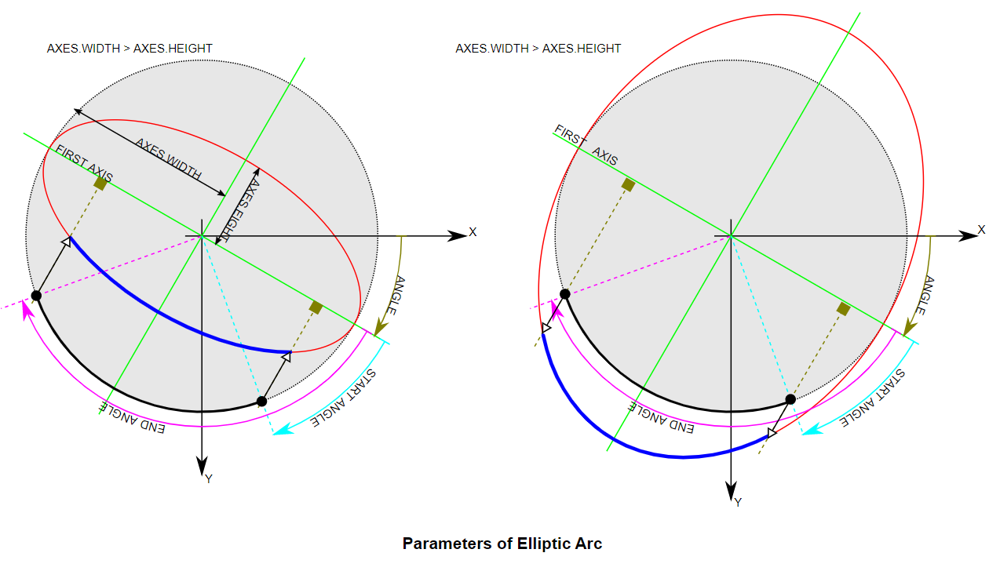
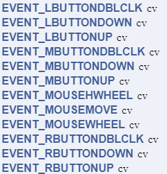

- [Note of Opencv to Python](#head1)
	- [Opencv 在Pycharm中的配置](#head2)
	- [ 将照片读入到矩阵中，并显示](#head3)
	- [ 窗口操作](#head4)
	- [ waitKey函数](#head5)
	- [ 视频与电脑摄像头输入](#head6)
	- [ 获取图片的信息](#head7)
	- [ 绘图功能](#head8)
	- [ 鼠标操作响应](#head9)
	- [ 色彩空间转换](#head10)
	- [ Print函数Tips](#head11)
	- [ 遍历像素点](#head12)
	- [ 矩阵操纵（创建一幅图像)](#head13)
	- [ 获取程序执行时间](#head14)
	- [ 提取某颜色对应的像素](#head15)
	- [ 图像通道的合并、分离、单通道操作](#head16)
	- [ 图像算术运算、逻辑运算](#head17)
	- [ 调整对比度和亮度](#head18)
	- [ ROI选择](#head19)
	- [ 泛洪填充](#head20)
	- [ 图像模糊（图像平滑）](#head21)
		- [ 概述](#head22)
		- [ 分类及应用场景](#head23)
	- [使用git, Typora，github创建笔记](#head24)
	- [ 在matlab中使用hough变换检测圆](#head25)
		- [ 1.编程思路](#head26)
		- [ 2.代码实现](#head27)
		- [ 3.结果展示](#head28)
[TOC]


### <span id="head1">Note of Opencv to Python</span>

#### <span id="head2">Opencv 在Pycharm中的配置</span>

```python
pip install opencv-python
pip install opencv-contrib-python #扩展库
pip install pytesseract
```

新建python项目，注意解释器正确配置应该如下：


#### <span id="head3"> 将照片读入到矩阵中，并显示</span>

```python
src = cv.imread("D:/IMG_20161227_154705.jpg")
cv.imshow("input", src) #input为窗口名
cv.waitKey(0) 必须要有
cv.imwrite("D:/result.jpg", gray)
cv.waitKey(0)
cv.destroyAllWindows()
```

cv.IMREAD_COLOR：读入一副彩色图像。图像的透明度会被忽略，这是默认参数。

cv.IMREAD_GRAYSCALE：以灰度模式读入图像

cv.IMREAD_UNCHANGED：读入一幅图像，并且包括图像的alpha 通道

可使用python自带的Matplotlib显示图像。但注意opencv为BGR，Matplotlib为RGB，被opencv的imread读入后，不能被Matplotlib显示.

#### <span id="head4"> 窗口操作</span>

```python
cv.namedWindow("input", cv.WINDOW_AUTOSIZE) 适应图片大小
cv.WINDOW_NORMAL 窗口大小可调节
CV_WINDOW_OPENGL 支持OpenGL
namedWindow()创建一个窗口。imshow可以直接指定窗口名，可以省去此函数（默认调用），但如果显示图像之前需要其他窗口操作时，需要调用此函数
destroyWindow() 关闭特定窗口 # cv.destroyWindow("video")
destroyAllWindows()关闭所有的HighGUI窗口
cv.startWindowThread() 
```

在调用cv.startWindowThread();后，即使没有调用waitKey()函数，图片也依然实时刷新。opencv的imshow()函数调用以后，并不立即刷新显示图片，而是等到waitKey()后才会刷新图片显示，所以cv.startWindowThread();是新开一个线程实时刷新图片显示。

#### <span id="head5"> waitKey函数</span>

1.使用OpenCV的imshow函数显示图片，必须配合waitKey 函数使用，才能将图片显示在windows窗体上。否则，imshow 函数单独使用只能弹出空白窗体，而无法显示图片。

2.waitKey的时间延迟，只对Windows窗体有效，而且是 namedWindow 函数创造的OpenCV窗体，对于MFC或者Qt这种GUI窗体是否有效是一种未知结果,

<u>不设置参数</u>：特定的几毫秒之内，如果按下任意键，这个函数会返回按键的ASCII 码值，程序将会继续运行。如果没有键盘输入，返回值为-1

<u>ASCII码值</u>：0~127，共128个

<u>设置参数</u>：使用waitKey(0) （无限等待）来判断相应按键操作，若为64位电脑，则需设置为k=cv2.waitKey(0)&0xFF。

3.真正能起到程序暂停的作用的是我们熟悉的Windows API函数Sleep

```python
k = cv2.waitKey(0)
if k == 27: # wait for ESC key to exit
	cv2.destroyAllWindows()
elif k == ord('s'): # wait for 's' key to save and exit
	cv2.imwrite('messigray.png',img)
	cv2.destroyAllWindows()
```

#### <span id="head6"> 视频与电脑摄像头输入</span>

```python
def video_demo(): #无输入值
	#capture = cv.VideoCapture("D:/IMG_9764.MP4") #0为读取电脑摄像头，读取的视频无声音，大小有限制
	capture = cv.VideoCapture(0) #0为设备索引号，自带摄像头一般为0
	# Define the codec and create VideoWriter object
	fourcc = cv.VideoWriter_fourcc(*'XVID')
	out = cv2.VideoWriter('output.avi',fourcc, 20.0, (640,480))
if capture.isOpened() == 1:
print("camera has been initialized correctly")
elif capture.isOpened() == 0:
print("camera has not been initialized correctly")
while(True):
	ret, frame = capture.read() #返回一个布尔值，若帧读取正确，则为True，每一帧
	frame1 = cv.flip(frame, 1) #镜像变换 1为左右 -1为上下
	frame2 = cv.transpose(frame) #顺时针旋转90°
	cv.imshow("video", frame) #每一帧循环显示
	cv.imshow("video1", frame1)
out.write(frame1)
print(capture.get(3)) #获取每一帧的宽度
	cv.imshow("video2", frame2)
	c = cv.waitKey(1) #响应用户操作
	#if c == 27:
		#break
#capture.release() #Closes video file or capturing device
if c & oxFF ==ord('q')
	break
```

视频写入时FourCC码以cv.FOURCC('M','J','P','G') 或者cv.FOURCC(*'MJPG'）传给fourcc

从文件播放视频时，使用cv.waiKey() 设置适当的持续时间，一般25ms合适，设置地高的话，视频播放地慢

<u>cap.read()</u>：若帧读取正确，返回True，检查其返回值判断视频文件是否到结尾

<u>cap.isOpened()</u>：摄像头成功初始化，返回True，否则使用cap.open()

<u>cap.get(propId)</u>：获得视频的参数信息，propId 可以是0 到18 之间的任何整数,见下表：

```python
• CV_CAP_PROP_POS_MSEC #Current position of the video file
in milliseconds.
• CV_CAP_PROP_POS_FRAMES #0-based index of the frame to
be decoded/captured next.
• CV_CAP_PROP_POS_AVI_RATIO #Relative position of the
video file: 0 - start of the film, 1 - end of the film.
• CV_CAP_PROP_FRAME_WIDTH #Width of the frames in the
video stream.
• CV_CAP_PROP_FRAME_HEIGHT #Height of the frames in the
video stream.
• CV_CAP_PROP_FPS #Frame rate.
• CV_CAP_PROP_FOURCC #4-character code of codec.
• CV_CAP_PROP_FRAME_COUNT #Number of frames in the
video file.
• CV_CAP_PROP_FORMAT #Format of the Mat objects returned
by retrieve() .
• CV_CAP_PROP_MODE #Backend-specific value indicating the
current capture mode.
• CV_CAP_PROP_BRIGHTNESS #Brightness of the image (only
for cameras).
• CV_CAP_PROP_CONTRAST #Contrast of the image (only for
cameras).
• CV_CAP_PROP_SATURATION #Saturation of the image (only
for cameras).
• CV_CAP_PROP_HUE #Hue of the image (only for cameras).
• CV_CAP_PROP_GAIN #Gain of the image (only for cameras).
• CV_CAP_PROP_EXPOSURE #Exposure (only for cameras).
• CV_CAP_PROP_CONVERT_RGB #Boolean flags indicating
whether images should be converted to RGB.
• CV_CAP_PROP_WHITE_BALANCE #Currently unsupported
• CV_CAP_PROP_RECTIFICATION #Rectification flag for stereo
cameras (note: only supported by DC1394 v 2.x backend currently)
```

cap.set(propId,value)：修改视频参数，value为新值

3—width，4—hight

#### <span id="head7"> 获取图片的信息</span>

```python
def get_image_info(image):
	print(type(image)) # <class 'numpy.ndarray'>
	print(image.shape) #显示高，宽，通道数
	print(image.size)  #总的像素数据大小=高*宽*通道数
	print(image.dtype)  #显示像素数据类型
	pixel_data = np.array(image)  #通过numpy获取像素值
	# print(pixel_data)
	print(image) 可以直接打印
```

#### <span id="head8"> 绘图功能</span>

img：想要绘图的图像

color：BGR模式输入

thickness:默认为1，对于封闭图形设置为-1可实现填充

lineType：8连接，抗锯齿型连接（平滑性好，cv2.LINE_AA）

shift:坐标点与数轴的精度，默认为0

后五个参数的顺序一般如上

Drawing Line：

```python
img = np.zeros((512,512,3), np.uint8)
img = cv2.line(img,(0,0),(511,511),(255,0,0),5) #指定直线的起点和终点，画多条线时可用cv.polylines()
img = cv2.rectangle(img,(384,0),(510,128),(0,255,0),3) #指定矩形的左上顶点和右下顶点
img = cv2.circle(img,(447,63), 63, (0,0,255), -1) #指定圆心，半径
img = cv2.ellipse(img,(256,256),(100,50),0,0,180,(255, 0, 0),-1)
#img	=	cv.ellipse(	img, center, axes, angle, startAngle, endAngle, color[, thickness[, lineType[, shift]]]	)

pts = np.array([[10,5],[20,30],[70,20],[50,10]], np.int32)
pts = pts.reshape((-1,1,2)) #reshape 的第一个参数为-1, 表明这一维的长度是根据后面的维度的计算出来的。
img = cv2.polylines(img,[pts],True,(0,255,255)) #若为第三个参数为False，则该多边形不封闭，首尾不想连

font = cv2.FONT_HERSHEY_SIMPLEX
cv2.putText(img,'OpenCV',(10,500), font, 4,(255,255,255),2,cv2.LINE_AA) #位置，字体类型，字体大小，颜色，粗细，线条的类型
```



#### <span id="head9"> 鼠标操作响应</span>

事件列表：



```python
# mouse callback function
def draw_circle(event,x,y,flags, param):
if event == cv.EVENT_LBUTTONDBLCLK:
cv.circle(img, [x, y], 10, (255, 0, 0), -1)


# Create a black image, a window and bind the function to window
img = np.zeros((512, 512, 3), np.uint8)
cv.namedWindow('image')
cv.setMouseCallback('image', draw_circle)
while(1):
cv.imshow('image',img)
if cv.waitKey(20) & 0xFF == 27:
break
cv.destroyAllWindows()
```


#### <span id="head10"> 色彩空间转换</span>

```python
gray = cv.cvtColor(src, cv.COLOR_BGR2GRAY) #获取灰度图像
dst = cv.bitwise_not(image) # 通过逻辑非运算来获得负片
gray = cv.cvtColor(image, cv.COLOR_BGR2GRAY)
back_rgb = cv.cvtColor(gray, cv.COLOR_GRAY2BGR)
```

#### <span id="head11"> Print函数Tips</span>

```python
打印变量值
print("width : %s, height : %s channels : %s" % (width, height, channels))
打印矩阵
print(image)
```

#### <span id="head12"> 遍历像素点</span>

```python
def access_pixels(image):
	height = image.shape[0]
	width = image.shape[1]
	channels = image.shape[2]
	print("width : %s, height : %s channels : %s" % (width, height, channels))
	for row in range(height):
		for col in range(width):
			for c in range(channels):
				pv = image[row, col, c]
				image[row, col, c] = 255 – pv        
	cv.imshow("demo", image)
```

#### <span id="head13"> 矩阵操纵（创建一幅图像)</span>

ones创建任意维度和元素个数的数组，其元素值均为1
empty一样，只是它所常见的数组内所有元素均为空

```python
zeros([m,n…],int8) 创建任意维度和元素个数的数组，其元素值均为0
img = np.zeros([400, 400, 3], np.uint8)
#img = np.ones([400, 400, 3]) * 255
# img[:, :, 2] = np.ones([400, 400])*255 #对2通道像素平面进行操作
# cv.imshow("new image", img)
matrix = np.ones([6, 6], np.float32) # 有浮点数计算一定选float
```

fill用来填充矩阵，
reshape可以进行矩阵重组，元素数相同

```python
matrix.fill(1625.35) 
```

cv.convertScaleAbs() 可以将浮点数转化为uint8 ，负数转换为绝对值

```python
m2 = matrix.reshape([3, 12]) 
```

array生成任意矩阵，可以作为算子

```
m3 = np.array([[1,2,3], [4,5,6], [7,8,9]],np.int32)
```


#### <span id="head14"> 获取程序执行时间</span>

```python
t1 = cv.getTickCount()
create_image() #程序
t2 = cv.getTickCount()
time = (t2 - t1) / cv.getTickFrequency()
print("time = %s ms" % (time * 1000))
```

可以通过调用opencv自带的API来减少程序执行时间

#### <span id="head15"> 提取某颜色对应的像素</span>

思路：转换到HSV空间，再参考下表设置inRange函数的参数(红色设置为第二列较佳)


```python
def extract_object_demo():
	capture = cv.VideoCapture("D:/IMG_9764.MP4")
	while(True):
		ret, frame = capture.read() # 先将每一帧读入
	if ret == False:
		break
	hsv = cv.cvtColor(frame, cv.COLOR_BGR2HSV)  
	lower_hsv = np.array([0, 43, 46]) # 找出白色
	upper_hsv = np.array([10, 255, 255])
	mask = cv.inRange(hsv, lowerb=lower_hsv, upperb=upper_hsv)
	dst = cv.bitwise_and(frame, frame, mask=mask)
	cv.imshow("video", frame)
	cv.imshow("mask", dst) #将含有红色的像素提取以红色在黑色视频中显示 
	c = cv.waitKey(50)
	if c == 27:
		break  # escape
```

#### <span id="head16"> 图像通道的合并、分离、单通道操作</span>

```python
b, g, r = cv.split(src)
cv.imshow("blue", b)
cv.imshow("green", g)
cv.imshow("red", r)
src = cv.merge([b, g, r]) # 注意此处的输入
src[:, :, 0] = 0
cv.imshow("changed image", src)
h, w = src.shape[0:2] #获取图像的高与宽，0可以不输入
print(src[30, 30, :]) #打印某位置上的三个像素值
```

#### <span id="head17"> 图像算术运算、逻辑运算</span>

```python
dst = cv.add(m1, m2) #相加
dst = cv.subtract(m1, m2) #相减
dst = cv.divide(m1, m2) #除
dst = cv.multiply(m1, m2) #乘
M1 = cv.mean(m1) #获取均值
M2, dev2 = cv.meanStdDev(m2) #获取均值和方差
Tips：方差越小，则该图片包含的信息越少，可设置阈值来过滤无意义的图片
dst1 = cv.bitwise_or(m1, m2)
dst2 = cv.bitwise_and(m1, m2) # 可以作为一个“遮罩”
dst3 = cv.bitwise_not(m1) #获得负片
```


#### <span id="head18"> 调整对比度和亮度</span>

```python
def contrast_brightness_demo(image, c, b):
	h, w, ch = image.shape #取出shape的前两位【：2】
	blank = np.zeros([h, w, ch], image.dtype)
	dst = cv.addWeighted(image, c, blank, 1-c, b) #调整对比度和亮度,none的均可以接收，dst = 	src1*alpha + src2*beta + gamma
	cv.imshow("con_bri_demo", dst)
像素运算式：dst = src1*alpha + src2*beta + gamma
```

#### <span id="head19"> ROI选择</span>

```python
face = src[50:250, 100:300] # [height, width]
gray = cv.cvtColor(face, cv.COLOR_BGR2GRAY)
backrgb = cv.cvtColor(gray, cv.COLOR_GRAY2BGR)
src[50:250, 100:300] = backrgb
cv.imshow("face", src)
```

#### <span id="head20"> 泛洪填充</span>

```python
def fill_color_demo(image):
	copyImg = image.copy()
	h, w = image.shape[:2]
	mask = np.zeros([h+2, w+2], np.uint8) #底层代码要求必须这么写
	cv.floodFill(copyImg, mask, (30, 30), (0, 255, 255), (100, 100, 100), (50, 50, 50), 	cv.FLOODFILL_FIXED_RANGE)
	cv.imshow("fill_color_demo", copyImg)
```


```python
def fill_binary():
	image = np.zeros([400, 400, 3], np.uint8)
	image[100:300, 100:300, :] = 255
	cv.imshow("fill_binary", image)
	mask = np.ones([402, 402, 1], np.uint8)
	mask[100:300, 100:300] = 0
	cv.floodFill(image, mask, (200, 200), (255, 255, 0), cv.FLOODFILL_MASK_ONLY)#只填充mask标记为（0，0）的像素点
	cv.imshow("filled binary", image)
```

#### <span id="head21"> 图像模糊（图像平滑）</span>

##### <span id="head22"> 概述</span>

低通滤波：去除噪音，模糊图像，但去除了高频成分（噪声、边界）

高通滤波：找到边缘

空间滤波的数学原理:二维空间卷积

##### <span id="head23"> 分类及应用场景</span>

平均：卷积框覆盖区域所有像素的平均值来代替中心元素

高斯：方框中心的值最大，其余方框根据距离中心元素的距离递减，构成一个高斯小山包。原来的求平均数现在变成求加权平均数，权就是方框里的值，X与y方向的标准差相等，若设置为0，则函数根据核的大小自动计算

```python
# 0是指根据窗口大小（5,5）来计算高斯函数标准差
blur = cv2.GaussianBlur(img,(5,5),0)
```

只考虑像素之间的空间关系，而不会考虑像素值之间的关系（像素的相似度）

中值：用与卷积框对应像素的中值来替代中心像素的值，去除椒盐噪声

双边：保持边界清晰的情况下有效的去除噪音，使用空间高斯权重（位置差异越小权重越大）与灰度值相似性高斯权重（灰度值差异越小权重越大）,边缘处灰度值与中心像素灰度值相比变化大，权重小不会被模糊

```python
# 9是邻域直径，两个75分别是空间高斯函数标准差，灰度值相似性高斯函数标准差
blur = cv2.bilateralFilter(img,9,75,75)
```

关于算子：元素个数为奇数，总和为0：进行边缘和梯度计算，总和为1进行增强锐化等
Tips：blurry模糊的，不清楚的，污脏的


```python
dst = cv.blur(image, (1, 15)) #均值模糊，模糊只是卷积的表象
dst = cv.medianBlur(image, 5) #中值模糊
def custom_blur_demo(image): #自定义卷积核来模糊
	# kernel = np.ones([5, 5], np.float32)/25 #最多25个255，防止溢出
	kernel = np.array([[0, -1, 0], [-1, 5, -1], [0, -1, 0]], np.float32)
	dst = cv.filter2D(image, -1, kernel=kernel)
	cv.imshow("custom_blur_demo" ,dst)
```

#### <span id="head24">使用git, Typora，github创建笔记</span>

```
ssh-keygen -t rsa -C "youremail@example.com" #设置秘钥
github上添加秘钥
git config --global user.email "you@example.com"
git config --global user.name "Your Name"
git init #初始化该文件夹
git status #获取当前git状态
git diff #获取文件更改内容
git log #查看修改记录

git remote add origin git@github.com:perfectism13/learning.git #关联本地与远程仓库
git push -u origin master
git pull git@github.com:perfectism13/learning.git
git add . #ubantu中为./
git commit -m "information of update"
git push git@github.com:perfectism13/learning.git
```

[](https://www.cnblogs.com/fanyong/p/3424501.html)

[](https://blog.csdn.net/ajianyingxiaoqinghan/article/details/70544159)

windows中的ssh key在c/users/闵晨阳1998/.ssh中

ubantu在home/.ssh中

#### <span id="head25"> 在matlab中使用hough变换检测圆</span>

##### <span id="head26"> 1.编程思路</span>

1.读入图像，并将其灰度化

2.利用canny算子来检测边缘

3.设定检测时的半径与角度步长，预估被检测圆的半径范围

4.通过圆的参数方程将图像空间(x,y)对应到参数空间(a,b,r)

5.求解半径和圆心

6.合并圆心临近，半径差别不大的圆

7.标记出检测到的圆，并输出圆心坐标和半径

##### <span id="head27"> 2.代码实现</span>

```matlab
%author：minchenyang
image = imread('D:/opencv_imagedata/detect_blob.png');  
figure(1),imshow(image),title('原图')
% 将原图灰度化
image = rgb2gray(image); 
figure(2),imshow(image),title('灰度化的原图')  
%采用canny算子来进行边缘检测
edgeimage = edge(image, 'Canny', [0.3, 0.35]); 
% 设定检测时的半径与角度步长
step_r = 1;step_angle = 0.1; 
%预估被检测圆的半径范围
rmin = 10;  rmax = 100; 
% 自动取最优的灰度阈值
thresh = graythresh(image);  
r_min = rmin;r_max = rmax;
element=[];  para=[];  
p=0.6;%p=thresh
[h,w] = size(edgeimage);  
size_r = round((rmax-rmin)/step_r)+1; 
size_angle = round(2*pi/step_angle);  
hough_space = zeros(h,w,size_r);  
%查找二值图像中非零元素的行列坐标  
[row,col] = find(edgeimage);
count = size(row);  
%通过圆的参数方程将图像空间(x,y)对应到参数空间(a,b,r)  
for i=1:count  
for r=1:size_r  
for k=1:size_angle
a = round(row(i)-(r_min+(r-1)*step_r)*cos(k*step_angle)); % a=x-r*cos(angle)  
b = round(col(i)-(r_min+(r-1)*step_r)*sin(k*step_angle)); % b=y-r*sin(angle)   
if(a>0&&a<=h&&b>0&&b<w)  
hough_space(a,b,r) = hough_space(a,b,r)+1; 
end  
end  
end  
end  
% 搜索超过阈值的聚集点
max_para = max(max(max(hough_space)));
num = find(hough_space>=max_para*p);  
length = size(num);  
%求解半径和圆心  
for i=1:count  
for k=1:length  
para3 = floor(num(k)/(h*w))+1; 
para2 = floor((num(k)-(para3-1)*(h*w))/h)+1; 
para1 = num(k)-(para3-1)*(h*w)-(para2-1)*h;
if((row(i)-para1)^2+(col(i)-para2)^2<(r_min+(para3-1)*step_r)^2+5&&...  
(row(i)-para1)^2+(col(i)-para2)^2>(r_min+(para3-1)*step_r)^2-5)  
hough_circle(row(i),col(i)) = true;  
end  
end  
end
for k=1:length  
para3 = floor(num(k)/(h*w))+1;
para2 = floor((num(k)-(para3-1)*(h*w))/h)+1;  
para1 = num(k)-(para3-1)*(h*w)-(para2-1)*h;  
element = [element;para1,para2,para3];  
hough_circle(para1,para2)= true;  
end  
%合并圆心临近，半径差别不大的圆 
while size(element,1) >= 1  
num=1;  
xyr=[];  
temp1=element(1,1);temp2=element(1,2);temp3=element(1,3);  
c1=temp1;c2=temp2;c3=temp3;  
temp3= r_min+(temp3-1)*step_r;  
if size(element,1)>1       
for k=2:size(element,1)  
if (element(k,1)-temp1)^2+(element(k,2)-temp2)^2 > temp3^2  
xyr=[xyr;element(k,1),element(k,2),element(k,3)];  %保存剩下圆的圆心和半径位置  
else    
c1=c1+element(k,1);  
c2=c2+element(k,2);  
c3=c3+element(k,3);  
num=num+1;  
end   
end  
end   
c1=round(c1/num);  
c2=round(c2/num);  
c3=round(c3/num);  
c3=r_min+(c3-1)*step_r;      
para=[para;c1,c2,c3]; %保存各个圆的圆心和半径的值  
element=xyr;
end
figure(3),imshow(edgeimage),title('边缘')  
figure(4),imshow(hough_circle),title('检测出的圆上的像素点')  
element=para;  
%标记出检测到的圆，并输出圆心坐标和半径  
[r,~]=size(element);  
fprintf(1,'  检测出%d个圆\n',r);  
fprintf(1,'  圆心     半径\n'); 
for w=1:r  
fprintf(1,'%d （%d，%d）  %d\n',w,floor(element(w,1)),floor(element(w,2)),floor(element(w,3))); 
end   
figure(5),imshow(image),title('检测出图中的圆')  
hold on;  
plot(element(:,2), element(:,1), 'r+');  
for k = 1 : r   
t=0:0.01*pi:2*pi;  
x=cos(t).*element(k,3)+element(k,2);
y=sin(t).*element(k,3)+element(k,1);  
plot(x,y,'.','Markersize',10);  
end 
```

##### <span id="head28"> 3.结果展示</span>


