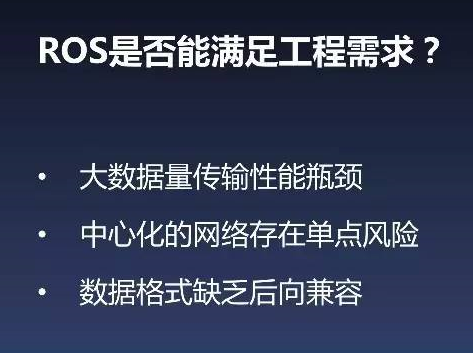
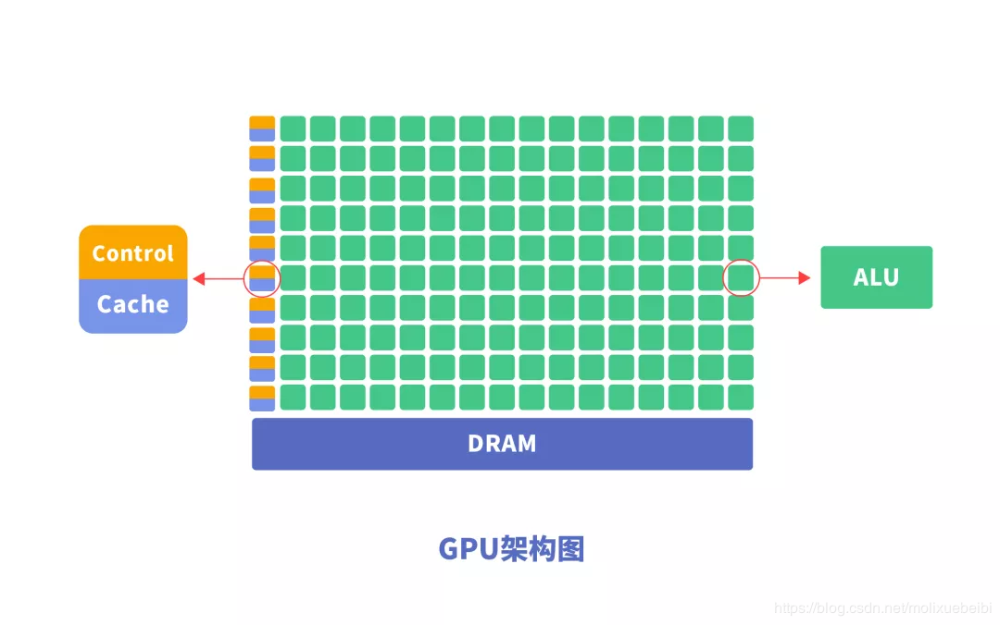

# 平台框架部分补充

闵晨阳 车辆1601 2019.11.14

## ROS常见开源库

pcl： Point Cloud Library是用于点云处理任务和3D几何处理的算法的开源库 

openrave： 开放式机器人自动化虚拟环境为在现实世界的机器人应用中测试，开发和部署运动规划算法提供了一个环境 

openni： 验证和提高互操作性自然用户界面和有机用户接口对于自然交互（NI）设备，使用这些设备的应用程序和中间件这便于此类设备的访问和使用

BSD 许可协议：Berkeley Software Distribution license，是自由软件中使用最广泛的许可协议之一。BSD 就是遵照这个许可证来发布，也因此而得名 BSD 许可协议。

## Apollo Ros有何不同

详见： http://blog.exbot.net/archives/3437 

 **一、 自动驾驶对ROS框架的三点需求** 

自动驾驶系统非常复杂，包含感知、障碍物检测、决策、车辆控制等模块，把这么多功能各异的模块集成在一起，组成一个完整的系统并完成自动驾驶的任务，这是一个非常大挑战。

**1、高效的开发支持**，快速的算法迭代要求ROS框架要能提供良好的开发模式，算法工程师更多聚焦在算法本身的开发和功能验证上。通过一个框架统一完成诸如配置管理、环境配置、整体运行以及调试等功能，快速构建系统原型，验证算法和功能。

**2、模块灵活配置**，感知、定位、决策模块，本身功能相对独立，通过接口定义数据。工程师在整体开发中希望各个模块独立开发、调试，应用时能通过框架快速集合成完整的系统并运行。

**3、丰富的调试工具**，自动驾驶系统涉及大量图像、点云处理算法，对于各种可视化工具有非常高需求，障碍物检测是否精准， 规划路径是否合理、定位是否正确，这些环节在调试过程中都需要可视化工具的支持。

 **二、 为什么选用ROS框架？** 

**1、行业认可**，ROS框架很早就被机器人行业所使用，目前有3000多个基础库，能够支持应用的快速开发。

**2、消息机制**，ROS在开发过程中，基于功能把整个自动驾驶系统分成多个模块，每个模块负责自己消息的接收、处理、发布。当模块需要联调时，通过框架可以把各个模块快速的集成到一起。

**3、使用广泛**，ROS是学术界使用最广泛的框架，对于验证最新的算法非常便利。

正是基于以上特性，在Apollo1.0版本中选择ROS作为开发和集成的框架。

 **三、Apollo中ROS的改进** 

**1、通信性能优化**

**｜问题：自动驾驶大量使用传感器引发很大的传输带宽需求**

自动驾驶系统为了能够感知复杂的道路情况，需要多种传感器协同工作才能覆盖不同的场景、不同路况需求。多传感器共同使用会对车载系统造成很大压力。

 **｜解决优化：共享内存能减少传输中的数据拷贝，显著提升传输效率** 

 **｜问题：单路传感器消息有多个消费者时负载成倍增长** 

**｜解决优化：共享内存可以有效满足一对多的传输场景**

 共享内存本身的特性能够支持一次写入、多次读取功能。对于一对多传输场景，不同的使用者就可以同时读取，实现一次写入，多次读取的功能，成倍提升传输效率。 

 **｜通信性能优化效果** 

A、一对一传输过程中，共享内存吞吐量达到socket两倍，一对多传输过程中，共享内存传输对带宽的优势进一步扩大。

B、共享内存传输延迟比Shared节省一半，对强实时性系统的自动驾驶汽车帮助很大。

C、共享内存CPU资源占用要比socket减少很多，一定程度上提升计算算法和能力。

**2、去中心化的网络拓扑**

**｜ROS特点：ROS以Master为中心构建hybridp2p拓扑网络**

ROS是以Master为中心构建Hybrid p2p拓扑网络，带来了<u>比较强的容错性，不同语言模块隔离，模块开发低耦合，</u>当某个算法出现异常导致崩溃的时候，不会引起整个的异常，为局部异常处理提供便利。

**｜问题：Master作为拓扑网络的中心，一旦异常将影响整个网络**

<u>整个系统非常依赖Master这个单点</u>，一旦Master异常，所有节点都不能发现其他节点，这样整个系统就不能正常工作，<u>缺乏异常恢复机制</u>。

**｜解决优化：使用RTPS服务发现协议实现完全的P2P网络拓扑**

在ROS中添加基于RTPS服务协议功能，网络构建不会以Master作为中心，而是通过域概念作为划分，所有节点加入域中，会通过RTPS协议相互广播通知其他节点，然后节点间会建立点对点连接，来发布订阅消息，以替代Master作为中央信息交换的功能。

**｜使用RTPS服务发现过程**

A. Sub节点启动，通过组播向网络注册

 B、通过节点发现，两两建立unicast 

 C、向新加入的节点发送历史拓扑消息 

 D、收发双发建立连接，开始通信 

**3、数据兼容性扩展**

**｜Message是ROS中描述软件组件接口的语言**

Message是ROS中描述接口的一种语言，当两个节点之间需要建立连接的时候，通常需要满足两个条件。一是接收和发送的Topic属于同一个话题，二是两个模块定义的模式要完全一致。

**｜ROS使用msg描述文件定义模块间的消息接口**

ROS怎么定义message？ROS使用msg文件对数据接口进行抽象化的描述，并可以生成不同语言的接口实现，以满足不同语言的通信交流需求。

**｜问题：接口升级后，不同版本的模块难以兼容**

兼容性的问题，当项目规模比较小时，影响不大；但是对于无人自动驾驶比较庞大的项目时，影响就很大。当某一个模块接口升级了，需要把所有相关模块升级到最新版本之后，才能在一起进行基础功能的连调。同时对于线下仿真调试的时候，有时需要把某一个模块回到历史版本验证或定位某一个问题，这时候若接口之间出现升级，就会出现不兼容问题，导致系统运行障碍。

**｜问题:接口升级后，历史数据也面临无法使用的问题**

接口兼容性问题会对历史数据使用造成更大影响，自动驾驶汽车系统中历史数据是非常宝贵和重要资源，对于这种问题有一些解决方式，一是通过离线数据批量转换和在线方式，二是转换成新数据。

**｜解决优化：protobuf能够很好支持向后兼容**

使用protobuf来替代ROSmessage，最大好处是可以完全覆盖message中本身包含的类型，有利于把既有的ROSmessage迁移到protobuf格式下。此外protobuf有非常好的版本兼容性。

**｜解决优化：protobuf消息格式与ROS深度集成**

 在Apollo ROS中，做了一整套对protobuf的支持， 在工程中可以不需要做protobuf和ROS message的转换，直接publish protobuf格式的消息，调试工具也能够非常正确的解析出来正确的protobuf消息。这样既能够很好解决兼容性问题，也不会产生额外的学习成本和使用成本。 

## 平台框架

**OTA**: 空中下载（OTA）是通过移动通信的空中接口实现对移动终端设备及SIM卡数据进行远程管理的技术。 

**DuerOS**:是百度[度秘](https://baike.baidu.com/item/度秘)事业部研发的对话式人工智能系统。 

**HMI**:Human Machine Interface  , 人机界面（又称用户界面或使用者界面）是系统和用户之间进行交互和信息交换的媒介， 它实现信息的内部形式与人类可以接受形式之间的转换。凡参与人机信息交流的领域都存在 着人机界面。 

**黑盒子存在的原因**：

### **端到端**： 

端到端就意味着完整性、完备性 ，一种工作态度

​				单个模块即便能正常工作，但当各个模块组合成为一个系统时，整个系统可能不能正常工作，因此必须在整个系统的输出与输出之间建立一种端到端的连接，使整个系统能够正常工作

**｜Rule base的特点：**

1.系统复杂性，需要人工设计上千个模块。

2.高精地图的成本，更新必须及时。

3.车载硬件计算能力，每个模块都要深度学习，车辆最多可能需要运行十几个深度学习网络，对计算能力和消耗需求很大。

**｜功能、系统工程复杂度、算法要求**

人们开车的时候有两类行为：一类可以边打电话边开车，我们称之为Reactive control（无脑操作）。需要集中注意力做出判断的，是Proactive planning。End-to-End系统到目前为止，主要实现了Reactive control，Proactive planning尚处于探索阶段。每一个message背后其实都是一个复杂的系统，End-to-End大部分系统自己完成，算法要求都很高。

**｜可解释性**

自动驾驶对安全性要求极高，必须做可解释性的东西。很多公司不做End-to-End系统，主要原因是其不可解释，而Rule based是可解释的。但限制Rule based往前发展的恰恰就是面临的不确定性因素，尤其是复杂环境。可解释性不应该成为这两个系统选择或者是评比优劣的点，最终的评比应该是客观的指标性的东西，比如能安全运行多少公里。

**｜广铺成本**

Rule based广铺成本面临的大问题是高精地图，End-to-End目前还不需要高精地图，普通导航系统即可。

**｜传感器成本**

Rule based相对高一些，End-to-End相对低一些。并不是End-to-End系统需要的传感器少，而在于它对传感器的利用率高。以摄像头为例，宝马的自动驾驶方案中，前档有3个摄像头，周围一圈又有不少，每个摄像头都对应了Rule based系统中特定的功能。而End-to-End系统是用神经网络拟合，如不同的摄像头中所需要的像素级别的融合，可以自己用机器识别出，或者机器自己判断和加工中所需要的过程，更高效的利用传感器。

**｜车载计算资源、核心问题、关系**

车载计算资源的实践差距非常大，Rule based的研发和广铺成本极高，而End-to-End系统核心问题主要在于数据，它的所有行为需要数据，而目前开源闭源都很难有优质的数据需要训练。Rule based和End-to-End更像互补关系。对于普通的，需要在边打电话边开车的场合，End-to-End更适合；对于入口和街区，Rule based更靠谱。

###  RTOS

是指当外界事件或数据产生时，能够接受并以足够快的速度予以处理，其处理的结果又能在规定的时间之内来控制生产过程或对处理系统做出快速响应，调度一切可利用的资源完成实时任务，并控制所有实时任务协调一致运行的操作系统。提供及时响应和高可靠性是其主要特点

### 硬件连接

### 软件连接

## 计算平台体系结构设计

详见： https://cloud.tencent.com/developer/article/1004746?from=10680 

### 异构计算

主要是指使用不同类型指令集和体系架构的计算单元组成系统的计算方式。

异构计算近年来得到更多关注，主要是因为通过提升CPU时钟频率和内核数量而提高计算能力的传统方式遇到了散热和能耗瓶颈。而与此同时，GPU等专用计算单元虽然工作频率较低，具有更多的内核数和并行计算能力，总体性能-芯片面积比和性能-功耗比都很高，却远远没有得到充分利用。广义上，不同计算平台的各个层次上都存在异构现象，除硬件层的指令集、互联方式、内存层次之外，软件层中[应用二进制接口](https://zh.wikipedia.org/wiki/应用二进制接口)、API、语言特性底层实现等的不同，对于上层应用和服务而言，都是异构的。

### GPU 

 **G**raphics **P**rocessing **U**nit  ，EX： **NVIDIA DRIVE PX 2** 

GPU专为图像处理设计，主频一般在500mhz左右，但是核多啊，比如titan,有380多个流处理单元，500*400就是200g这个量级，远大与于前面2者了。

GPU的设计出发点在于GPU更适用于<u>计算强度高、多并行</u>的计算。因此，GPU把晶体管更多用于计算单元，而不像CPU用于数据Cache和流程控制器。这样的设计是因为并行计算时每个数据单元执行相同程序，不需要繁琐的流程控制而更需要高计算能力，因此也不需要大的cache容量。

GPU同CPU一样也是指令执行过程：取指令 ->指令译码 ->指令执行，只有在指令执行的时候，计算单元才发挥作用。GPU的逻辑控制单元相比CPU简单，所以要想做到指令流水处理，提高指令执行效率，必然要求处理的算法本身复杂度低，处理的数据之间相互独立，所以<u>算法本身的串行处理会导致GPU浮点计算能力的显著降低</u>。

 

 与CPU相比，CPU芯片空间的不到20%是ALU，而GPU芯片空间的80%以上是ALU。即GPU拥有更多的ALU用于数据并行处理 

-  NVIDIA的PX平台是目前领先的基于GPU的无人驾驶解决方案。每个PX2由两个Tegra SoC和两个Pascal GPU图形处理器组成，其中每个图像处理器都有自己的专用内存并配备有专用的指令以完成深度神经网络加速。为了提供高吞吐量，每个Tegra SOC使用PCI-E Gen 2 x4总线与Pascal GPU直接相连，其总带宽为4 GB/s。此外，两个CPU-GPU集群通过千兆以太网项链，数据传输速度可达70 Gigabit/s。借助于优化的I/O架构与深度神经网络的硬件加速，每个PX2能够每秒执行24兆次深度学习计算。这意味着当运行AlexNet深度学习典型应用时，PX2的处理能力可达2800帧/秒。  

1 、<u>多线程，提供了多核并行计算的基础结构，且核心数非常多，可以支撑大量数据的并行计算。</u>

<u>2、拥有更高的访存速度。</u>

<u>3、更高的浮点运算能力</u>。

 因此，GPU比CPU更适合深度学习中的<u>大量训练数据、大量矩阵、卷积运算</u>。 

### CPU

 **C**entral **P**rocessing **U**nit ，

一般来说CPU运算能力最弱，CPU虽然主频最高，但是单颗也就8核、16核的样子，一个核3.5g，16核也就56g，再考虑指令周期，每秒最多也就30g次乘法。还是定点的。

 CPU作为通用处理器，兼顾计算和控制，70%晶体管用来构建Cache 还有一部分控制单元，<u>用来处理复杂逻辑和提高指令的执行效率</u>，如图6所示，所以<u>导致计算通用性强，可以处理计算复杂度高，但计算性能一般</u>。<u>适合逻辑控制运算</u>

-  CPU的指令执行过程是：取指令 ->指令译码 ->指令执行，只有在指令执行的时候，计算单元才发挥作用，这样取指令和指令译码的两段时间，计算单元是不在工作的，
-   

 CPU遵循的是冯诺依曼架构，其核心是存储程序、顺序执行。CPU的架构中需要大量的空间去放置存储单元（Cache）和控制单元（Control），相比之下计算单元（ALU）只占据了很小的一部分，所以它在大规模并行计算能力上极受限制，而更擅长于逻辑控制。 CPU无法做到大量矩阵数据并行计算的能力，但GPU可以。  

### FPGA

Field Programmable Gate Array ,现场可编程逻辑门阵列，EX: **Altera** 的 **CycloneV SoC** 

FPGA的运算能力的，拿高端的来说。3000多个固定乘法器，拿数字逻辑还能搭3000个，最快能到接近300mhz, 也就是1800g这个量级。

FPGA作为一种高性能、低功耗的可编程芯片，可以根据客户定制来做针对性的算法设计。所以在处理海量数据的时候，FPGA 相比于CPU 和GPU，无指令，无需共享内存，优势在于：<u>FPGA计算效率更高，FPGA更接近IO。</u>

FPGA不采用指令和软件，是软硬件合一的器件。对FPGA进行编程要使用硬件描述语言，硬件描述语言描述的逻辑可以直接被编译为晶体管电路的组合。所以FPGA实际上直接用晶体管电路实现用户的算法，没有通过指令系统的翻译。 它就是一堆逻辑门电路的组合，可以编程，还可以重复编程。  用户可以通过烧入FPGA 配置文件来定义这些门电路以及存储器之间的连线。这种烧入不是一次性的，<u>可重复编写定义，重复配置</u>。 

-  FPGA的编程逻辑块（Programable Logic Blocks）中包含很多功能单元，由LUT（Look-up Table）、触发器组成。<u>FPGA是直接通过这些门电路来实现用户的算法，没有通过指令系统的翻译，执行效率更高</u> <u>，大规模并行运算</u>

- FPGA由于算法是定制的，所以没有CPU和GPU的取指令和指令译码过程，数据流直接根据定制的算法进行固定操作，计算单元在每个时钟周期上都可以执行，所以<u>可以充分发挥浮点计算能力，计算效率高于CPU和GPU</u>。<u>性能高、功耗低、可硬件编程的特点， 开发使用硬件描述语言，开发门槛相对GPU、NPU高</u>。

    Altera公司的Cyclone V SoC是一个基于FPGA的无人驾驶解决方案，现已应用在奥迪无人车产品中。Altera公司的FPGA专为传感器融合提供优化，可结合分析来自多个传感器的数据以完成高度可靠的物体检测。类似的产品有Zynq专为无人驾驶设计的Ultra ScaleMPSoC。当运行卷积神经网络计算任务时，Ultra ScaleMPSoC运算效能为14帧/秒/瓦，优于NVIDIA Tesla K40 GPU可达的4帧/秒/瓦。同时，在目标跟踪计算方面，Ultra ScaleMPSoC在1080p视频流上的处理能力可达60fps。  

### ASIC

 **A**pplication **S**pecific **I**ntegrated **C**ircuit  专用集成电路, EX: **Mobileye** 的 **Eyeq5** 

优越性：<u>体积小、功耗低、计算性能高、计算效率高、芯片出货量越大成本越低。但是缺点也很明显：算法是固定的，一旦算法变化就可能无法使用</u>。FPGA成本高面向企业军工，ASIC成本面向消费电子。

 Mobileye是一家基于ASIC的无人驾驶解决方案提供商。其Eyeq5 SOC装备有四种异构的全编程加速器，分别对专有的算法进行了优化，包括有：计算机视觉、信号处理和机器学习等。Eyeq5 SOC同时实现了两个PCI-E端口以支持多处理器间通信。这种加速器架构尝试为每一个计算任务适配最合适的计算单元，硬件资源的多样性使应用程序能够节省计算时间并提高计算效能。  

### DSP

 **digital signal processor** 数字信号处理器，EX:德州仪器的 **TDA2x**

DSP虽然主频不如CPU,但是胜在乘法器多，随随便便带16个乘法器，还是浮点的。再来个4核，8核，还有特定的算法硬件加速，所以虽然主频只有1,2g但是运算能力还是比CPU强。当然现在出现了带专用乘法器的CPU，DSP也集了ARM核，这两个的界限开始模糊了。
DSP所有计算均使用浮点算法，而且目前还没有位或整数运算指令

德州仪器提供了一种基于DSP的无人驾驶的解决方案。其TDA2x SoC拥有两个浮点DSP内核C66x和四个专为视觉处理设计的完全可编程的视觉加速器。相比ARM Cortex-15处理器，视觉加速器可提供八倍的视觉处理加速且功耗更低。类似设计有CEVA XM4。这是另一款基于DSP的无人驾驶计算解决方案，专门面向计算视觉任务中的视频流分析计算。使用CEVA XM4每秒处理30帧1080p的视频仅消耗功率30MW，是一种相对节能的解决方案。  

总结：

  		  ① 这几个应用场合不同，CPU虽然运算不行，但是擅长管理和调度，比如读取数据，管理文件，人机交互等，例程多，辅助工具也很多。
            ② DSP相比而言管理弱了，运算加强了。这两者都是靠高主频来解决运算量的问题，适合有<u>大量递归操作以及不便拆分</u>的算法。
            ③ GPU管理更弱，运算更强，但由于是多进程并发，更适合整块数据进行流处理的算法
            ④ FPGA能管理能运算，但是开发周期长，复杂算法开发难度大。适合流处理算法，不管是整块数据进还是一个一个进。还有实时性来说，FPGA是最高的。前3种处理器为了避免将运算能力浪费在数据搬运上，一般要求累计一定量数据后才开始计算，产生群延时，而FPGA所有操作都并行，因此群延时可以很小

### 总结

 能耗比方面：ASIC > FPGA > GPU > CPU 

以人脸识别为例， 其处理基本流程及对应功能模块所需的算力分布如下： 

## 摩尔定律

摩尔定律（英语：Moore's law）是由英特尔（Intel）创始人之一戈登·摩尔提出的。其内容为：集成电路上可容纳的晶体管数目，约每隔两年便会增加一倍；经常被引用的“18个月”，是由英特尔首席执行官大卫·豪斯（David House）提出：预计18个月会将芯片的性能提高一倍（即更多的晶体管使其更快），是一种以倍数增长的观测。

## 车辆实时操作系统

详见： https://zhuanlan.zhihu.com/p/45294616 

### QNX

QNX，英文名Quick Unix，是由加拿大QSSL公司（2010年被加拿大黑莓公司收购）开发的分布式实时操作系统，采用独特的微内核实时平台，相比Windos、Linux等大型操作系统，QNX内核极小且运行速度极快。 除了快，QNX的实时性、稳定性也极高，据说MTTF（平均失效时间）可以达到99.999%（5个9），也就是说，一年365天当中，它可能出错的时间只有31秒。

**EX**：Apollo2.0整合了QNX操作系统，大众、宝马、丰田、菲亚特、福特等

### WinCE

Windos Embedbed Compact,  微软Windows操作系统中的一员 ,相对于Android系统的丰富体验，Windos CE就显得捉襟见肘。由于车机系统大部分应用场景是导航和音乐，移动互联时代，任何一部智能手机都能取代车机，而获得更佳的用户体验。

**EX**： 早期如凯立德、四维图新等车载导航系统供应商，都是基于Windos CE开发的  

### Linux

免费开源、可个性化定制、 稳定性及处理效率较好、 基于Linux开发的难度也极大，而且开发周期比较长，  限制了车机系统进入门槛，除了规模较大的主机厂，以及有实力的车机供应商，能够花重金雇佣一支专业操作系统研发团队，其余的也只能望尘莫及 。

**EX:** 凯迪拉克CUE系统 

### VxWorks 

美国 Wind River System 公司（ 简称风河公司 ，即 WRS 公司）推出的一个实时操作系统。